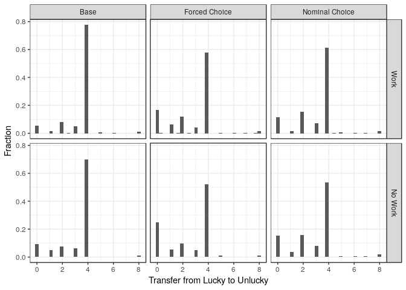
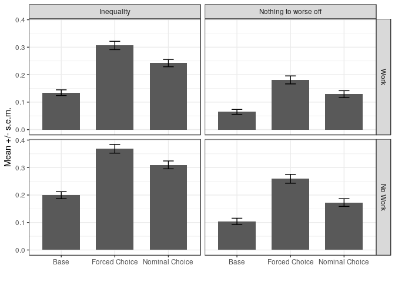
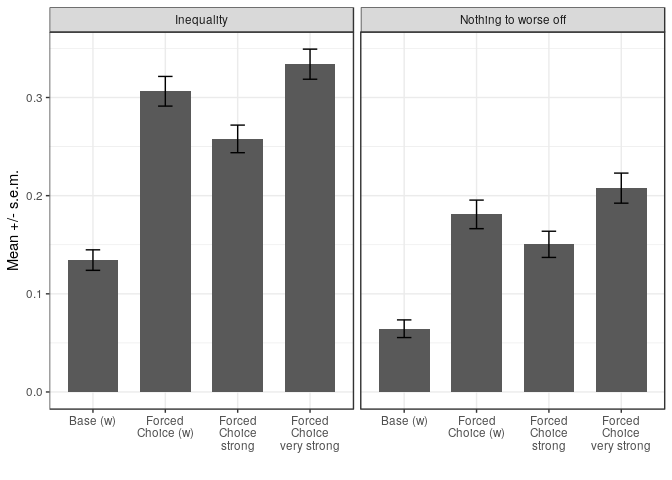
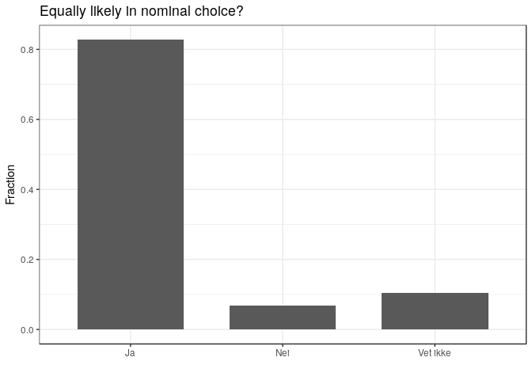
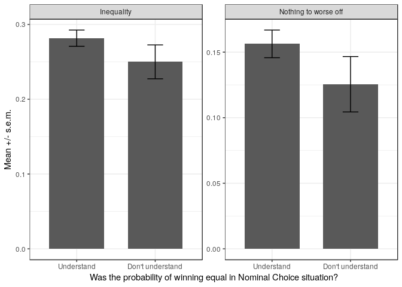
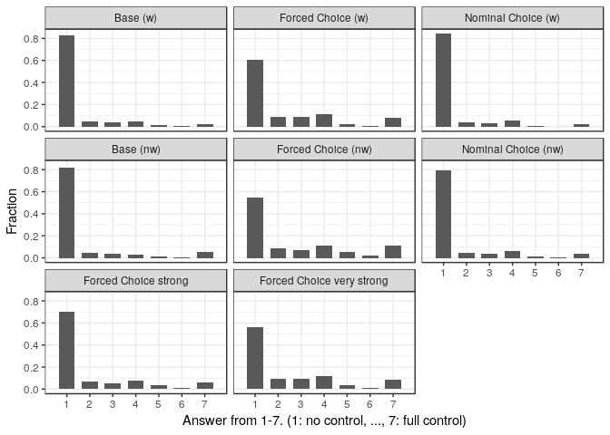

Revision part II (kantar)
================
Erik
30 september, 2018

Reading in data.
================

I have saved data from `reading_kantar_files.Rmd` into memory.

``` r
treatmentsv = c("Base (w)", "Forced Choice (w)", "Nominal Choice (w)", 
                "Base (nw)", "Forced Choice (nw)", "Nominal Choice (nw)",
                "Forced Choice strong", "Forced Choice very strong")
treatmentsv_short = c("Base", "Forced Choice", "Nominal Choice")
df_k <- read_csv("data/bl_kantar.csv", na=c("","NA","NaN"), guess_max=10000) %>% 
  mutate(treatment = factor(treatment, levels=treatmentsv),
         treatment_kantar = factor(treatment_kantar),
         treatmentgroup = factor(treatmentgroup, levels=treatmentsv_short),
         treatmentgroup8 = fct_recode(treatment,
                                      "Base" = "Base (w)",
                                      "Base" = "Base (nw)",
                                      "Nominal Choice" = "Nominal Choice (w)",
                                      "Nominal Choice" = "Nominal Choice (nw)",
                                      "Forced Choice" = "Forced Choice (w)",
                                      "Forced Choice" = "Forced Choice (nw)",
                                      "Forced Choice" = "Forced Choice strong",
                                      "Forced Choice" = "Forced Choice very strong"),
         gender = factor(gender),
         education = factor(education),
         indincome = factor(indincome),
         work_temp = fct_relevel(as.factor(workp), c("TRUE", "FALSE")),
         work = fct_recode(work_temp, 
                           "Work" = "TRUE", 
                           "No Work"= "FALSE"),
         inequality = abs(8 - 2*y)/8.0,
         zero_to_worst_off = (y %in% c(0,8)),
         university = (education %in% c("Universitet/hoyskole I", "Universitet/hoyskole II")),
         high_income = (indincome %in% c("1.000.000 kroner eller mer", 
                                         "800.000 - 999.999 kroner",
                                         "700-000 - 799.999 kroner",
                                         "600.000 - 699.999 kroner",
                                         "500.000 - 599.999 kroner")),  # Median is within 400-499 group.
         female = (gender=="Kvinne"),
         choice = (treatmentgroup %in% c("Forced Choice", "Nominal Choice")),
         age_h = (age > median(age)),
         crt_h = (crt %in% c(2,3)),
         understanding2n = as.numeric(gsub("[^0-9]","", understanding2))) %>%
  filter(comp==1)
```

Descriptive figures
===================

Histogram of transfers to the unlucky
-------------------------------------

First out is a histogram of the transfer to the unlucky participant. I make it for each of the three main treatments, with and without work. The "FALSE" means there is no work.

``` r
df_k %>% filter(org_weakp==TRUE) %>% 
  ggplot(aes(x=y, y=1* (..count..)/tapply(..count..,..PANEL..,sum)[..PANEL..])) + 
  geom_histogram() + facet_grid(work~treatmentgroup) + theme_bw() + ylab("Fraction") + 
  xlab("Transfer from Lucky to Unlucky")
```

    ## `stat_bin()` using `bins = 30`. Pick better value with `binwidth`.



``` r
ggsave("graphs/histograms_kantar.pdf")
```

    ## Saving 7 x 5 in image
    ## `stat_bin()` using `bins = 30`. Pick better value with `binwidth`.

### The share that equalizes

``` r
df_equal <- df_k %>% mutate(equal = (y==4)) 
df_equal %>% 
  group_by(treatment) %>% 
  summarize(share_equal=mean(equal))
```

    ## # A tibble: 8 x 2
    ##   treatment                 share_equal
    ##   <fct>                           <dbl>
    ## 1 Base (w)                        0.777
    ## 2 Forced Choice (w)               0.580
    ## 3 Nominal Choice (w)              0.613
    ## 4 Base (nw)                       0.698
    ## 5 Forced Choice (nw)              0.520
    ## 6 Nominal Choice (nw)             0.533
    ## 7 Forced Choice strong            0.621
    ## 8 Forced Choice very strong       0.531

``` r
ce <- df_equal %>%
  group_by(treatment) %>% summarize( yc= sum(y==4), n=n())
prop.test(ce$yc[ce$treatment %in% c("Base (w)", "Nominal Choice (w)") ], 
          ce$n[ce$treatment %in% c("Base (w)", "Nominal Choice (w)") ])
```

    ## 
    ##  2-sample test for equality of proportions with continuity
    ##  correction
    ## 
    ## data:  ce$yc[ce$treatment %in% c("Base (w)", "Nominal Choice (w)")] out of ce$n[ce$treatment %in% c("Base (w)", "Nominal Choice (w)")]
    ## X-squared = 45.768, df = 1, p-value = 1.331e-11
    ## alternative hypothesis: two.sided
    ## 95 percent confidence interval:
    ##  0.1163097 0.2122463
    ## sample estimates:
    ##    prop 1    prop 2 
    ## 0.7771812 0.6129032

``` r
prop.test(ce$yc[ce$treatment %in% c("Base (w)", "Forced Choice (w)") ], 
          ce$n[ce$treatment %in% c("Base (w)", "Forced Choice (w)") ])
```

    ## 
    ##  2-sample test for equality of proportions with continuity
    ##  correction
    ## 
    ## data:  ce$yc[ce$treatment %in% c("Base (w)", "Forced Choice (w)")] out of ce$n[ce$treatment %in% c("Base (w)", "Forced Choice (w)")]
    ## X-squared = 63.975, df = 1, p-value = 1.26e-15
    ## alternative hypothesis: two.sided
    ## 95 percent confidence interval:
    ##  0.1488437 0.2459745
    ## sample estimates:
    ##    prop 1    prop 2 
    ## 0.7771812 0.5797721

### The share that gives nothing to unlucky

``` r
df_0  <- df_k %>% mutate(nothing = (y==0)) 
df_0 %>% 
  group_by(treatment) %>% 
  summarize(share_equal=mean(nothing))
```

    ## # A tibble: 8 x 2
    ##   treatment                 share_equal
    ##   <fct>                           <dbl>
    ## 1 Base (w)                       0.0523
    ## 2 Forced Choice (w)              0.167 
    ## 3 Nominal Choice (w)             0.114 
    ## 4 Base (nw)                      0.0942
    ## 5 Forced Choice (nw)             0.248 
    ## 6 Nominal Choice (nw)            0.153 
    ## 7 Forced Choice strong           0.134 
    ## 8 Forced Choice very strong      0.192

``` r
c0 <- df_0 %>%
  group_by(treatment) %>% summarize( y0= sum(y==0), n=n())
prop.test(c0$y0[c0$treatment %in% c("Base (w)", "Nominal Choice (w)") ], 
          c0$n[c0$treatment %in% c("Base (w)", "Nominal Choice (w)") ])
```

    ## 
    ##  2-sample test for equality of proportions with continuity
    ##  correction
    ## 
    ## data:  c0$y0[c0$treatment %in% c("Base (w)", "Nominal Choice (w)")] out of c0$n[c0$treatment %in% c("Base (w)", "Nominal Choice (w)")]
    ## X-squared = 17.297, df = 1, p-value = 3.197e-05
    ## alternative hypothesis: two.sided
    ## 95 percent confidence interval:
    ##  -0.09088272 -0.03162827
    ## sample estimates:
    ##     prop 1     prop 2 
    ## 0.05234899 0.11360449

``` r
prop.test(c0$y0[c0$treatment %in% c("Base (w)", "Forced Choice (w)") ], 
          c0$n[c0$treatment %in% c("Base (w)", "Forced Choice (w)") ])
```

    ## 
    ##  2-sample test for equality of proportions with continuity
    ##  correction
    ## 
    ## data:  c0$y0[c0$treatment %in% c("Base (w)", "Forced Choice (w)")] out of c0$n[c0$treatment %in% c("Base (w)", "Forced Choice (w)")]
    ## X-squared = 47.925, df = 1, p-value = 4.428e-12
    ## alternative hypothesis: two.sided
    ## 95 percent confidence interval:
    ##  -0.14757300 -0.08106234
    ## sample estimates:
    ##     prop 1     prop 2 
    ## 0.05234899 0.16666667

Mean inequality
---------------

The next descriptive figure is a bargraph showing the amount of inequality by treatment and work status.

``` r
df_mean_ineq_nothing_kantar <- df_k %>% filter(org_weakp==TRUE) %>%
  dplyr::select(treatmentgroup, work, inequality, zero_to_worst_off) %>%
  gather(inequality, zero_to_worst_off, key="outcome", value="y") %>%
  group_by(treatmentgroup, work, outcome) %>%
  summarize(mean_y = mean(y, na.rm=TRUE), se_y = sd(y, na.rm=TRUE)/sqrt(n())) %>%
  mutate(outcome = fct_recode(outcome, 
                              "Inequality" = "inequality",
                              "Nothing to worse off" = "zero_to_worst_off"))
df_mean_ineq_nothing_kantar
```

    ## # A tibble: 12 x 5
    ## # Groups:   treatmentgroup, work [6]
    ##    treatmentgroup work    outcome              mean_y    se_y
    ##    <fct>          <fct>   <fct>                 <dbl>   <dbl>
    ##  1 Base           Work    Inequality           0.134  0.0104 
    ##  2 Base           Work    Nothing to worse off 0.0644 0.00900
    ##  3 Base           No Work Inequality           0.199  0.0129 
    ##  4 Base           No Work Nothing to worse off 0.104  0.0115 
    ##  5 Forced Choice  Work    Inequality           0.306  0.0151 
    ##  6 Forced Choice  Work    Nothing to worse off 0.181  0.0145 
    ##  7 Forced Choice  No Work Inequality           0.368  0.0158 
    ##  8 Forced Choice  No Work Nothing to worse off 0.259  0.0161 
    ##  9 Nominal Choice Work    Inequality           0.242  0.0133 
    ## 10 Nominal Choice Work    Nothing to worse off 0.129  0.0126 
    ## 11 Nominal Choice No Work Inequality           0.310  0.0143 
    ## 12 Nominal Choice No Work Nothing to worse off 0.173  0.0141

``` r
df_mean_ineq_nothing_kantar %>%
ggplot(aes(x=treatmentgroup, y=mean_y)) + geom_bar(stat="identity", width=0.7) +
  geom_errorbar(aes(ymax=mean_y+se_y, ymin=mean_y - se_y), width=0.2) + 
  facet_grid(work ~ outcome) + xlab("") + ylab("Mean +/- s.e.m.") +
  theme_bw()
```



``` r
ggsave("graphs/mean_ineq_nothing_kantar.pdf")
```

    ## Saving 7 x 5 in image

Robustness for the "forced" alternative
=======================================

We did two variations of the "Forced Choice" treatment. One "strong" in which the alternative to the lottery was 0 cent with certainty, and one in which they actually had to pay 0.25 to avoid the lottery (I call it very-strong). Both these variants were with work. To look at the effect of this, I graph the level of inequality of the three forced choice treatments (with work) with the comparison to the base treatment.

``` r
df_k %>% filter(treatment %in% c("Base (w)", 
                                 "Forced Choice (w)", 
                                 "Forced Choice strong",
                                 "Forced Choice very strong")) %>%
  dplyr::select(treatment, inequality, zero_to_worst_off) %>%
  gather(inequality, zero_to_worst_off, key="outcome", value="y") %>%
  group_by(treatment, outcome) %>%
  summarize(mean_y = mean(y, na.rm=TRUE), se_y = sd(y, na.rm=TRUE)/sqrt(n())) %>%
  mutate(outcome = fct_recode(outcome, 
                              "Inequality" = "inequality",
                              "Nothing to worse off" = "zero_to_worst_off")) %>%
  ggplot(aes(x=treatment, y=mean_y)) + geom_bar(stat="identity", width=0.7) +
    geom_errorbar(aes(ymax=mean_y+se_y, ymin=mean_y - se_y), width=0.2) + 
    facet_wrap(~ outcome) + xlab("") + ylab("Mean +/- s.e.m.") +
    theme_bw() + scale_x_discrete(labels=c("Base (w)",
                                           "Forced\nChoice (w)", 
                                           "Forced\nChoice\nstrong",
                                           "Forced\nChoice\nvery strong"))
```



``` r
ggsave("graphs/mean_ineq_nothing_robust_kantar.pdf")
```

    ## Saving 7 x 5 in image

Are the differences between the forced treatments significant? First a test of mean implemented inequality being the same in all forced (work) treatments:

``` r
df_k %>% filter(treatment %in% c("Forced Choice (w)", 
                                 "Forced Choice strong",
                                 "Forced Choice very strong")) %>%
  oneway.test( inequality ~ treatment, data=.)
```

    ## 
    ##  One-way analysis of means (not assuming equal variances)
    ## 
    ## data:  inequality and treatment
    ## F = 6.9709, num df = 2.0, denom df = 1409.9, p-value = 0.0009715

Increases in implemented inequality compared to base treatment (for the forced choice variants).

``` r
df_k %>% filter(treatment %in% c("Base (w)", 
                                 "Forced Choice strong")) %>%
  t.test( inequality ~ treatment, data=.)
```

    ## 
    ##  Welch Two Sample t-test
    ## 
    ## data:  inequality by treatment
    ## t = -7.0516, df = 1335.4, p-value = 2.83e-12
    ## alternative hypothesis: true difference in means is not equal to 0
    ## 95 percent confidence interval:
    ##  -0.15782165 -0.08912204
    ## sample estimates:
    ##             mean in group Base (w) mean in group Forced Choice strong 
    ##                          0.1343624                          0.2578343

``` r
df_k %>% filter(treatment %in% c("Base (w)", 
                                 "Forced Choice very strong")) %>%
  t.test( inequality ~ treatment, data=.)
```

    ## 
    ##  Welch Two Sample t-test
    ## 
    ## data:  inequality by treatment
    ## t = -10.755, df = 1250.6, p-value < 2.2e-16
    ## alternative hypothesis: true difference in means is not equal to 0
    ## 95 percent confidence interval:
    ##  -0.2359653 -0.1631619
    ## sample estimates:
    ##                  mean in group Base (w) 
    ##                               0.1343624 
    ## mean in group Forced Choice very strong 
    ##                               0.3339260

Now, the same test for the proportion implementing the nothing to the worst off:

``` r
uz <- df_k %>% filter(treatment %in% c("Forced Choice (w)", 
                                 "Forced Choice strong",
                                 "Forced Choice very strong")) %>% 
  group_by(treatment, zero_to_worst_off) %>% 
  summarize(n=n()) %>% 
  spread(key=zero_to_worst_off, value=n) %>% 
  ungroup() %>%
  dplyr::select( -treatment) 
prop.test(as.matrix(uz))
```

    ## 
    ##  3-sample test for equality of proportions without continuity
    ##  correction
    ## 
    ## data:  as.matrix(uz)
    ## X-squared = 7.9248, df = 2, p-value = 0.01902
    ## alternative hypothesis: two.sided
    ## sample estimates:
    ##    prop 1    prop 2    prop 3 
    ## 0.8190883 0.8495822 0.7923186

Main regression tables
======================

Work and treatments
-------------------

In the following, we want to collapse the work and no-work treatments, so it is a question of interest whether there are interaction effects between the work requirement and treatments.

``` r
dfmain <- df_k %>% filter(org_weakp==TRUE)

w1 <- dfmain %>% lm(inequality ~ treatmentgroup*workp , data=.)
w2 <- dfmain %>% lm(inequality ~ treatmentgroup*workp + leftp + female + age_h + crt_h +
                             university + high_income, data=.)
w3 <- dfmain %>% lm(inequality ~ treatmentgroup + workp + leftp + female + age_h + crt_h +
                             university + high_income, data=.)
w4 <- dfmain %>% lm(zero_to_worst_off ~ treatmentgroup*workp , data=.)
w5 <- dfmain %>% lm(zero_to_worst_off ~ treatmentgroup*workp + leftp + female + age_h + crt_h +
                             university + high_income, data=.)
w6 <- dfmain %>% lm(zero_to_worst_off ~ treatmentgroup + workp + leftp + female + age_h + crt_h +
                             university + high_income, data=.)
```

We want to test the joint significance of the interactions

``` r
w1t <- glht(w1, linfct= c("`treatmentgroupForced Choice:workpTRUE` = 0",
                          "`treatmentgroupNominal Choice:workpTRUE` = 0"),
             vcov = cluster.vcov(w1, cluster=1:nrow(dfmain)))
w2t <- glht(w2, linfct= c("`treatmentgroupForced Choice:workpTRUE` = 0",
                          "`treatmentgroupNominal Choice:workpTRUE` = 0"),
             vcov = cluster.vcov(w2, cluster=1:nrow(dfmain)))
w4t <- glht(w4, linfct= c("`treatmentgroupForced Choice:workpTRUE` = 0",
                          "`treatmentgroupNominal Choice:workpTRUE` = 0"),
             vcov = cluster.vcov(w4, cluster=1:nrow(dfmain)))
w5t <- glht(w5, linfct= c("`treatmentgroupForced Choice:workpTRUE` = 0",
                          "`treatmentgroupNominal Choice:workpTRUE` = 0"),
             vcov = cluster.vcov(w5, cluster=1:nrow(dfmain)))

wrow <- c("Joint p-value on work-interactions:", 
          sprintf("%4.3f", summary(w1t)$test$pvalue[1]),
          sprintf("%4.3f", summary(w2t)$test$pvalue[1]), "",
          sprintf("%4.3f", summary(w4t)$test$pvalue[1]),
          sprintf("%4.3f", summary(w5t)$test$pvalue[1]), "")
```

Now for table output:

``` r
stargazer(w1, w2, w3, w4, w5, w6, 
          se = list(sqrt(diag(cluster.vcov(w1, cluster=1:nrow(dfmain)))),
                    sqrt(diag(cluster.vcov(w2, cluster=1:nrow(dfmain)))),
                    sqrt(diag(cluster.vcov(w3, cluster=1:nrow(dfmain)))),
                    sqrt(diag(cluster.vcov(w4, cluster=1:nrow(dfmain)))),
                    sqrt(diag(cluster.vcov(w5, cluster=1:nrow(dfmain)))),
                    sqrt(diag(cluster.vcov(w6, cluster=1:nrow(dfmain))))),
        add.lines=list(wrow),
        type="text", style="aer", df=FALSE, keep.stat=c("rsq","n"),
        p.auto=TRUE,
        order=c("treatmentgroup*", "workp"),
        star.char=c("", "",""), notes="", notes.append=FALSE, report="vcsp", header=FALSE)
```

    ## 
    ## ===============================================================================================
    ##                                              inequality                 zero_to_worst_off      
    ##                                        (1)       (2)       (3)       (4)       (5)       (6)   
    ## -----------------------------------------------------------------------------------------------
    ## treatmentgroupForced Choice           0.169     0.164     0.166     0.155     0.152     0.133  
    ##                                      (0.020)   (0.020)   (0.013)   (0.020)   (0.019)   (0.013) 
    ##                                     p = 0.000 p = 0.000 p = 0.000 p = 0.000 p = 0.000 p = 0.000
    ##                                                                                                
    ## treatmentgroupNominal Choice          0.110     0.114     0.108     0.069     0.071     0.066  
    ##                                      (0.019)   (0.019)   (0.013)   (0.018)   (0.018)   (0.012) 
    ##                                     p = 0.000 p = 0.000 p = 0.000 p = 0.001 p = 0.000 p = 0.000
    ##                                                                                                
    ## treatmentgroupForced Choice:workp     0.003     0.004              -0.039    -0.038            
    ##                                      (0.027)   (0.027)             (0.026)   (0.026)           
    ##                                     p = 0.913 p = 0.882           p = 0.141 p = 0.139          
    ##                                                                                                
    ## treatmentgroupNominal Choice:workp   -0.003    -0.011              -0.004    -0.009            
    ##                                      (0.026)   (0.025)             (0.024)   (0.024)           
    ##                                     p = 0.919 p = 0.651           p = 0.868 p = 0.689          
    ##                                                                                                
    ## workp                                -0.065    -0.065    -0.067    -0.040    -0.039    -0.055  
    ##                                      (0.017)   (0.016)   (0.011)   (0.015)   (0.014)   (0.011) 
    ##                                     p = 0.000 p = 0.000 p = 0.000 p = 0.007 p = 0.008 p = 0.000
    ##                                                                                                
    ## leftp                                          -0.062    -0.062              -0.046    -0.046  
    ##                                                (0.012)   (0.012)             (0.012)   (0.012) 
    ##                                               p = 0.000 p = 0.000           p = 0.001 p = 0.001
    ##                                                                                                
    ## female                                         -0.088    -0.088              -0.048    -0.048  
    ##                                                (0.011)   (0.011)             (0.011)   (0.011) 
    ##                                               p = 0.000 p = 0.000           p = 0.000 p = 0.000
    ##                                                                                                
    ## age_h                                          -0.076    -0.076              -0.060    -0.060  
    ##                                                (0.011)   (0.011)             (0.011)   (0.011) 
    ##                                               p = 0.000 p = 0.000           p = 0.000 p = 0.000
    ##                                                                                                
    ## crt_h                                           0.057     0.057               0.049     0.049  
    ##                                                (0.011)   (0.011)             (0.011)   (0.011) 
    ##                                               p = 0.000 p = 0.000           p = 0.000 p = 0.000
    ##                                                                                                
    ## university                                      0.019     0.019               0.026     0.027  
    ##                                                (0.011)   (0.011)             (0.011)   (0.011) 
    ##                                               p = 0.091 p = 0.090           p = 0.016 p = 0.016
    ##                                                                                                
    ## high_income                                     0.049     0.049               0.048     0.048  
    ##                                                (0.013)   (0.013)             (0.012)   (0.012) 
    ##                                               p = 0.001 p = 0.001           p = 0.000 p = 0.000
    ##                                                                                                
    ## Constant                              0.199     0.265     0.266     0.104     0.131     0.140  
    ##                                      (0.013)   (0.019)   (0.018)   (0.011)   (0.018)   (0.017) 
    ##                                     p = 0.000 p = 0.000 p = 0.000 p = 0.000 p = 0.000 p = 0.000
    ##                                                                                                
    ## Joint p-value on work-interactions:   0.992     0.985               0.252     0.248            
    ## Observations                          4,336     4,336     4,336     4,336     4,336     4,336  
    ## R2                                    0.043     0.096     0.096     0.031     0.065     0.065  
    ## -----------------------------------------------------------------------------------------------
    ## Notes:

From this we conclude that we can pool the work/no-work treatments, and simplify with only a dummy for work condition as a level shifter.

Writing the results also to a latex file.

Now for table output:

The role of choice
------------------

The first regression table just regress inequality (and zero to the worst off) on treatment indicators and demographics (Table 1 in submitted version). Given the graphs we have created, and the previous regression table, we want the tables to have dummies for"work" condition.

``` r
t1ineq_1 <-  dfmain %>% lm(inequality ~ treatmentgroup + workp  , data = . )
t1ineq_2 <-  dfmain %>% lm(inequality ~ treatmentgroup + workp +
                             leftp + female + age_h + crt_h, data=.)
t1ineq_3 <-  dfmain %>% lm(inequality ~ treatmentgroup + workp +
                             leftp + female + age_h + crt_h +
                             university + high_income, data=.)

t1noth_1 <-  dfmain %>% lm( zero_to_worst_off ~ treatmentgroup  + workp, data = . )
t1noth_2  <- dfmain %>% lm( zero_to_worst_off ~ treatmentgroup + workp +
                              leftp + female + age_h + crt_h, data=.)
t1noth_3  <- dfmain %>% lm( zero_to_worst_off ~ treatmentgroup + workp +
                              leftp + female + age_h + crt_h +
                              university + high_income, data=.)
```

Now, outputting these regressions to a table.

``` r
stargazer(t1ineq_1, t1ineq_2, t1ineq_3, t1noth_1, t1noth_2, t1noth_3,
          se = list(sqrt(diag(cluster.vcov(t1ineq_1, cluster=1:nrow(dfmain)))),
                    sqrt(diag(cluster.vcov(t1ineq_2, cluster=1:nrow(dfmain)))),
                    sqrt(diag(cluster.vcov(t1ineq_3, cluster=1:nrow(dfmain)))),
                    sqrt(diag(cluster.vcov(t1noth_1, cluster=1:nrow(dfmain)))),
                    sqrt(diag(cluster.vcov(t1noth_2, cluster=1:nrow(dfmain)))),
                    sqrt(diag(cluster.vcov(t1noth_3, cluster=1:nrow(dfmain))))),
         type="text", style="aer", df=FALSE, keep.stat=c("rsq","n"),
        p.auto=TRUE,
        star.char=c("", "",""), notes="", notes.append=FALSE, report="vcsp", header=FALSE)
```

    ## 
    ## ========================================================================================
    ##                                       inequality                 zero_to_worst_off      
    ##                                 (1)       (2)       (3)       (4)       (5)       (6)   
    ## ----------------------------------------------------------------------------------------
    ## treatmentgroupForced Choice    0.170     0.166     0.166     0.136     0.133     0.133  
    ##                               (0.014)   (0.013)   (0.013)   (0.013)   (0.013)   (0.013) 
    ##                              p = 0.000 p = 0.000 p = 0.000 p = 0.000 p = 0.000 p = 0.000
    ##                                                                                         
    ## treatmentgroupNominal Choice   0.109     0.108     0.108     0.066     0.066     0.066  
    ##                               (0.013)   (0.013)   (0.013)   (0.012)   (0.012)   (0.012) 
    ##                              p = 0.000 p = 0.000 p = 0.000 p = 0.000 p = 0.000 p = 0.000
    ##                                                                                         
    ## workp                         -0.065    -0.067    -0.067    -0.054    -0.055    -0.055  
    ##                               (0.011)   (0.011)   (0.011)   (0.011)   (0.011)   (0.011) 
    ##                              p = 0.000 p = 0.000 p = 0.000 p = 0.000 p = 0.000 p = 0.000
    ##                                                                                         
    ## leftp                                   -0.065    -0.062              -0.049    -0.046  
    ##                                         (0.012)   (0.012)             (0.012)   (0.012) 
    ##                                        p = 0.000 p = 0.000           p = 0.000 p = 0.001
    ##                                                                                         
    ## female                                  -0.097    -0.088              -0.056    -0.048  
    ##                                         (0.011)   (0.011)             (0.011)   (0.011) 
    ##                                        p = 0.000 p = 0.000           p = 0.000 p = 0.000
    ##                                                                                         
    ## age_h                                   -0.075    -0.076              -0.059    -0.060  
    ##                                         (0.011)   (0.011)             (0.011)   (0.011) 
    ##                                        p = 0.000 p = 0.000           p = 0.000 p = 0.000
    ##                                                                                         
    ## crt_h                                    0.065     0.057               0.058     0.049  
    ##                                         (0.011)   (0.011)             (0.011)   (0.011) 
    ##                                        p = 0.000 p = 0.000           p = 0.000 p = 0.000
    ##                                                                                         
    ## university                                         0.019                         0.027  
    ##                                                   (0.011)                       (0.011) 
    ##                                                  p = 0.090                     p = 0.016
    ##                                                                                         
    ## high_income                                        0.049                         0.048  
    ##                                                   (0.013)                       (0.012) 
    ##                                                  p = 0.001                     p = 0.000
    ##                                                                                         
    ## Constant                       0.199     0.298     0.266     0.111     0.174     0.140  
    ##                               (0.010)   (0.017)   (0.018)   (0.010)   (0.016)   (0.017) 
    ##                              p = 0.000 p = 0.000 p = 0.000 p = 0.000 p = 0.000 p = 0.000
    ##                                                                                         
    ## Observations                   4,336     4,336     4,336     4,336     4,336     4,336  
    ## R2                             0.043     0.091     0.096     0.030     0.058     0.065  
    ## ----------------------------------------------------------------------------------------
    ## Notes:

And to disk:

### What if we include also the variant forced choice alternatives?

Now, I repeate the above analysis but without the restriction to the 6 main treatments.

``` r
t18ineq_1 <-  df_k %>% lm(inequality ~ treatmentgroup8 + workp  , data = . )
t18ineq_2 <-  df_k %>% lm(inequality ~ treatmentgroup8 + workp +
                             leftp + female + age_h + crt_h, data=.)
t18ineq_3 <-  df_k %>% lm(inequality ~ treatmentgroup8 + workp +
                             leftp + female + age_h + crt_h +
                             university + high_income, data=.)

t18noth_1 <-  df_k %>% lm( zero_to_worst_off ~ treatmentgroup8  + workp, data = . )
t18noth_2  <- df_k %>% lm( zero_to_worst_off ~ treatmentgroup8 + workp +
                              leftp + female + age_h + crt_h, data=.)
t18noth_3  <- df_k %>% lm( zero_to_worst_off ~ treatmentgroup8 + workp +
                              leftp + female + age_h + crt_h +
                              university + high_income, data=.)
```

Now, outputting these regressions to a table.

``` r
stargazer(t18ineq_1, t18ineq_2, t18ineq_3, t18noth_1, t18noth_2, t18noth_3,
          se = list(sqrt(diag(cluster.vcov(t18ineq_1, cluster=1:nrow(df_k)))),
                    sqrt(diag(cluster.vcov(t18ineq_2, cluster=1:nrow(df_k)))),
                    sqrt(diag(cluster.vcov(t18ineq_3, cluster=1:nrow(df_k)))),
                    sqrt(diag(cluster.vcov(t18noth_1, cluster=1:nrow(df_k)))),
                    sqrt(diag(cluster.vcov(t18noth_2, cluster=1:nrow(df_k)))),
                    sqrt(diag(cluster.vcov(t18noth_3, cluster=1:nrow(df_k))))),
         type="text", style="aer", df=FALSE, keep.stat=c("rsq","n"),
        p.auto=TRUE,
        star.char=c("", "",""), notes="", notes.append=FALSE, report="vcsp", header=FALSE)
```

    ## 
    ## =========================================================================================
    ##                                        inequality                 zero_to_worst_off      
    ##                                  (1)       (2)       (3)       (4)       (5)       (6)   
    ## -----------------------------------------------------------------------------------------
    ## treatmentgroup8Forced Choice    0.166     0.162     0.162     0.130     0.127     0.127  
    ##                                (0.011)   (0.011)   (0.011)   (0.011)   (0.011)   (0.011) 
    ##                               p = 0.000 p = 0.000 p = 0.000 p = 0.000 p = 0.000 p = 0.000
    ##                                                                                          
    ## treatmentgroup8Nominal Choice   0.109     0.108     0.108     0.066     0.066     0.066  
    ##                                (0.013)   (0.013)   (0.013)   (0.012)   (0.012)   (0.012) 
    ##                               p = 0.000 p = 0.000 p = 0.000 p = 0.000 p = 0.000 p = 0.000
    ##                                                                                          
    ## workp                          -0.068    -0.069    -0.069    -0.058    -0.059    -0.059  
    ##                                (0.011)   (0.010)   (0.010)   (0.010)   (0.010)   (0.010) 
    ##                               p = 0.000 p = 0.000 p = 0.000 p = 0.000 p = 0.000 p = 0.000
    ##                                                                                          
    ## leftp                                    -0.067    -0.064              -0.050    -0.047  
    ##                                          (0.011)   (0.011)             (0.011)   (0.011) 
    ##                                         p = 0.000 p = 0.000           p = 0.000 p = 0.000
    ##                                                                                          
    ## female                                   -0.094    -0.084              -0.054    -0.044  
    ##                                          (0.010)   (0.010)             (0.010)   (0.010) 
    ##                                         p = 0.000 p = 0.000           p = 0.000 p = 0.000
    ##                                                                                          
    ## age_h                                    -0.077    -0.078              -0.056    -0.057  
    ##                                          (0.010)   (0.010)             (0.009)   (0.009) 
    ##                                         p = 0.000 p = 0.000           p = 0.000 p = 0.000
    ##                                                                                          
    ## crt_h                                     0.066     0.059               0.059     0.051  
    ##                                          (0.010)   (0.010)             (0.010)   (0.010) 
    ##                                         p = 0.000 p = 0.000           p = 0.000 p = 0.000
    ##                                                                                          
    ## university                                          0.016                         0.021  
    ##                                                    (0.010)                       (0.010) 
    ##                                                   p = 0.123                     p = 0.033
    ##                                                                                          
    ## high_income                                         0.050                         0.049  
    ##                                                    (0.011)                       (0.011) 
    ##                                                   p = 0.000                     p = 0.000
    ##                                                                                          
    ## Constant                        0.201     0.299     0.269     0.113     0.174     0.141  
    ##                                (0.010)   (0.015)   (0.016)   (0.009)   (0.015)   (0.015) 
    ##                               p = 0.000 p = 0.000 p = 0.000 p = 0.000 p = 0.000 p = 0.000
    ##                                                                                          
    ## Observations                    5,757     5,757     5,757     5,757     5,757     5,757  
    ## R2                              0.033     0.080     0.084     0.023     0.049     0.054  
    ## -----------------------------------------------------------------------------------------
    ## Notes:

Silently to file on disk.

Heterogeneity in effects
------------------------

In the new heterogeneity table, we treat the background variables symmetrically, so that we don't single out "political"" as being of primary importance.

### Heterogeneity in effects on inequality

``` r
h1_1 <- dfmain %>% lm(inequality ~ choice + leftp + workp + crt_h + female + age_h + university + high_income, 
                      data=. )
h1_2 <- dfmain %>% lm(inequality ~ choice + leftp + workp + crt_h + female + age_h + university + high_income +
                        choice*leftp, data=. )
h1_3 <- dfmain %>% lm(inequality ~ choice + leftp + workp + crt_h + female + age_h + university + high_income +
                        choice*female , data=. )
h1_4 <- dfmain %>% lm(inequality ~ choice + leftp + workp + crt_h + female + age_h + university + high_income +
                        choice*age_h, data=. )
h1_5 <- dfmain %>% lm(inequality ~ choice + leftp + workp + crt_h + female + age_h + university + high_income +
                        choice*crt_h, data=. )
h1_6 <- dfmain %>% lm(inequality ~ choice + leftp + workp + crt_h + female + age_h + university + high_income +
                        choice*university, data=. )
h1_7 <- dfmain %>% lm(inequality ~ choice + leftp + workp + crt_h + female + age_h + university + high_income +
                        choice*high_income, data=. )
h1_8 <- dfmain %>% lm(inequality ~ choice + leftp + workp + crt_h + female + age_h + university + high_income +
                        choice*leftp + choice*female + choice*age_h + choice*crt_h + choice*university + 
                        choice*high_income, data=. )
```

Want to include linear combinations for the columns 2-7:

``` r
ch2 <- glht(h1_2, linfct="choiceTRUE + choiceTRUE:leftpTRUE = 0", 
             vcov = cluster.vcov(h1_2, cluster=1:nrow(dfmain)))
ch3 <- glht(h1_3, linfct="choiceTRUE + choiceTRUE:femaleTRUE = 0", 
             vcov = cluster.vcov(h1_3, cluster=1:nrow(dfmain)))
ch4 <- glht(h1_4, linfct="choiceTRUE + choiceTRUE:age_hTRUE = 0", 
             vcov = cluster.vcov(h1_4, cluster=1:nrow(dfmain)))
ch5 <- glht(h1_5, linfct="choiceTRUE + choiceTRUE:crt_hTRUE = 0", 
             vcov = cluster.vcov(h1_5, cluster=1:nrow(dfmain)))
ch6 <- glht(h1_6, linfct="choiceTRUE + choiceTRUE:universityTRUE = 0", 
             vcov = cluster.vcov(h1_6, cluster=1:nrow(dfmain)))
ch7 <- glht(h1_7, linfct="choiceTRUE + choiceTRUE:high_incomeTRUE = 0", 
             vcov = cluster.vcov(h1_7, cluster=1:nrow(dfmain)))
sh1 <- c("Linear combination"," ", 
        sprintf("%4.3f", summary(ch2)$test$coefficients[1]),
        sprintf("%4.3f", summary(ch3)$test$coefficients[1]),
        sprintf("%4.3f", summary(ch4)$test$coefficients[1]),
        sprintf("%4.3f", summary(ch5)$test$coefficients[1]),
        sprintf("%4.3f", summary(ch6)$test$coefficients[1]),
        sprintf("%4.3f", summary(ch7)$test$coefficients[1]),
        "")
sh2 <- c("","",
        sprintf("(%4.3f)", summary(ch2)$test$sigma[1]),
        sprintf("(%4.3f)", summary(ch3)$test$sigma[1]),
        sprintf("(%4.3f)", summary(ch4)$test$sigma[1]),
        sprintf("(%4.3f)", summary(ch5)$test$sigma[1]),
        sprintf("(%4.3f)", summary(ch6)$test$sigma[1]),
        sprintf("(%4.3f)", summary(ch7)$test$sigma[1]),
        "")
sh3 <- c("", "",
        sprintf("p=%4.3f", summary(ch2)$test$pvalues[1]),
        sprintf("p=%4.3f", summary(ch3)$test$pvalues[1]),
        sprintf("p=%4.3f", summary(ch4)$test$pvalues[1]),
        sprintf("p=%4.3f", summary(ch5)$test$pvalues[1]),
        sprintf("p=%4.3f", summary(ch6)$test$pvalues[1]),
        sprintf("p=%4.3f", summary(ch7)$test$pvalues[1]),
        "")
```

``` r
stargazer( h1_1, h1_2, h1_3, h1_4, h1_5, h1_6, h1_7, h1_8,
           se = list( sqrt(diag(cluster.vcov(h1_1, cluster=1:length(h1_1$residuals)))),
                      sqrt(diag(cluster.vcov(h1_2, cluster=1:length(h1_2$residuals)))),
                      sqrt(diag(cluster.vcov(h1_3, cluster=1:length(h1_3$residuals)))),
                      sqrt(diag(cluster.vcov(h1_4, cluster=1:length(h1_4$residuals)))),
                      sqrt(diag(cluster.vcov(h1_5, cluster=1:length(h1_5$residuals)))),
                      sqrt(diag(cluster.vcov(h1_6, cluster=1:length(h1_6$residuals)))),
                      sqrt(diag(cluster.vcov(h1_7, cluster=1:length(h1_7$residuals)))),
                      sqrt(diag(cluster.vcov(h1_8, cluster=1:length(h1_8$residuals))))),
        order=c("choice","choiceTRUE:leftp","choiceTRUE:female", "choiceTRUE:age_h",
                "choiceTRUE:crt_h", "choiceTRUE:universityTRUE", "choiceTRUE:high_incomeTRUE"),
        add.lines=list(sh1,sh2,sh3), 
        type="text", style="aer", df=FALSE, keep.stat=c("rsq","n"),
        p.auto=TRUE,
        star.char=c("", "",""), notes="", notes.append=FALSE, report="vcsp")
```

    ## 
    ## ======================================================================================================
    ##                                                          inequality                                   
    ##                           (1)       (2)       (3)       (4)       (5)       (6)       (7)       (8)   
    ## ------------------------------------------------------------------------------------------------------
    ## choice                   0.137     0.154     0.160     0.168     0.114     0.133     0.126     0.176  
    ##                         (0.011)   (0.021)   (0.016)   (0.015)   (0.014)   (0.016)   (0.013)   (0.031) 
    ##                        p = 0.000 p = 0.000 p = 0.000 p = 0.000 p = 0.000 p = 0.000 p = 0.000 p = 0.000
    ##                                                                                                       
    ## choiceTRUE:leftp                  -0.024                                                      -0.018  
    ##                                   (0.024)                                                     (0.025) 
    ##                                  p = 0.315                                                   p = 0.473
    ##                                                                                                       
    ## choiceTRUE:female                           -0.048                                            -0.036  
    ##                                             (0.022)                                           (0.023) 
    ##                                            p = 0.027                                         p = 0.108
    ##                                                                                                       
    ## choiceTRUE:age_h                                      -0.069                                  -0.065  
    ##                                                       (0.022)                                 (0.022) 
    ##                                                      p = 0.002                               p = 0.003
    ##                                                                                                       
    ## choiceTRUE:crt_h                                                 0.049                         0.032  
    ##                                                                 (0.022)                       (0.022) 
    ##                                                                p = 0.026                     p = 0.159
    ##                                                                                                       
    ## choiceTRUE:university                                                      0.006              -0.001  
    ##                                                                           (0.022)             (0.022) 
    ##                                                                          p = 0.772           p = 0.954
    ##                                                                                                       
    ## choiceTRUE:high_income                                                               0.031     0.017  
    ##                                                                                     (0.024)   (0.025) 
    ##                                                                                    p = 0.187 p = 0.493
    ##                                                                                                       
    ## leftp                   -0.062    -0.046    -0.062    -0.062    -0.062    -0.062    -0.062    -0.051  
    ##                         (0.012)   (0.019)   (0.012)   (0.012)   (0.012)   (0.012)   (0.012)   (0.019) 
    ##                        p = 0.000 p = 0.014 p = 0.000 p = 0.000 p = 0.000 p = 0.000 p = 0.000 p = 0.006
    ##                                                                                                       
    ## workp                   -0.067    -0.068    -0.068    -0.068    -0.068    -0.067    -0.067    -0.068  
    ##                         (0.011)   (0.011)   (0.011)   (0.011)   (0.011)   (0.011)   (0.011)   (0.011) 
    ##                        p = 0.000 p = 0.000 p = 0.000 p = 0.000 p = 0.000 p = 0.000 p = 0.000 p = 0.000
    ##                                                                                                       
    ## crt_h                    0.058     0.058     0.058     0.057     0.025     0.058     0.058     0.036  
    ##                         (0.011)   (0.011)   (0.011)   (0.011)   (0.017)   (0.011)   (0.011)   (0.017) 
    ##                        p = 0.000 p = 0.000 p = 0.000 p = 0.000 p = 0.131 p = 0.000 p = 0.000 p = 0.031
    ##                                                                                                       
    ## female                  -0.088    -0.089    -0.057    -0.089    -0.088    -0.088    -0.088    -0.065  
    ##                         (0.011)   (0.011)   (0.017)   (0.011)   (0.011)   (0.011)   (0.011)   (0.017) 
    ##                        p = 0.000 p = 0.000 p = 0.001 p = 0.000 p = 0.000 p = 0.000 p = 0.000 p = 0.001
    ##                                                                                                       
    ## age_h                   -0.077    -0.077    -0.077    -0.031    -0.076    -0.077    -0.076    -0.033  
    ##                         (0.011)   (0.011)   (0.011)   (0.016)   (0.011)   (0.011)   (0.011)   (0.016) 
    ##                        p = 0.000 p = 0.000 p = 0.000 p = 0.055 p = 0.000 p = 0.000 p = 0.000 p = 0.042
    ##                                                                                                       
    ## university               0.020     0.020     0.020     0.020     0.020     0.016     0.020     0.021  
    ##                         (0.011)   (0.011)   (0.011)   (0.011)   (0.011)   (0.016)   (0.011)   (0.017) 
    ##                        p = 0.082 p = 0.084 p = 0.082 p = 0.074 p = 0.084 p = 0.342 p = 0.082 p = 0.207
    ##                                                                                                       
    ## high_income              0.048     0.048     0.048     0.047     0.048     0.048     0.027     0.035  
    ##                         (0.013)   (0.013)   (0.013)   (0.013)   (0.013)   (0.013)   (0.019)   (0.019) 
    ##                        p = 0.001 p = 0.001 p = 0.001 p = 0.001 p = 0.001 p = 0.001 p = 0.144 p = 0.066
    ##                                                                                                       
    ## Constant                 0.267     0.256     0.252     0.248     0.282     0.269     0.274     0.242  
    ##                         (0.018)   (0.021)   (0.019)   (0.019)   (0.018)   (0.019)   (0.018)   (0.024) 
    ##                        p = 0.000 p = 0.000 p = 0.000 p = 0.000 p = 0.000 p = 0.000 p = 0.000 p = 0.000
    ##                                                                                                       
    ## Linear combination                 0.129     0.112     0.099     0.163     0.139     0.157            
    ##                                   (0.013)   (0.014)   (0.015)   (0.017)   (0.015)   (0.020)           
    ##                                   p=0.000   p=0.000   p=0.000   p=0.000   p=0.000   p=0.000           
    ## Observations             4,336     4,336     4,336     4,336     4,336     4,336     4,336     4,336  
    ## R2                       0.092     0.093     0.093     0.094     0.093     0.092     0.093     0.096  
    ## ------------------------------------------------------------------------------------------------------
    ## Notes:

Now to latex table on file

### Restricting heterogeneity table to Nominal Choice

For the appendix, we want to show heterogeneity with respect to each of the types of choice separately. First, restricting to nominal choice.

``` r
dfmain_nc <- dfmain %>% filter(treatmentgroup != "Forced Choice")
```

The regression tables are the same on this more restricted sample.

``` r
hnc1_1 <- dfmain_nc %>% lm(inequality ~ choice + leftp + workp + crt_h + female + age_h + university + high_income, 
                      data=. )
hnc1_2 <- dfmain_nc %>% lm(inequality ~ choice + leftp + workp + crt_h + female + age_h + university + high_income +
                        choice*leftp, data=. )
hnc1_3 <- dfmain_nc %>% lm(inequality ~ choice + leftp + workp + crt_h + female + age_h + university + high_income +
                        choice*female , data=. )
hnc1_4 <- dfmain_nc %>% lm(inequality ~ choice + leftp + workp + crt_h + female + age_h + university + high_income +
                        choice*age_h, data=. )
hnc1_5 <- dfmain_nc %>% lm(inequality ~ choice + leftp + workp + crt_h + female + age_h + university + high_income +
                        choice*crt_h, data=. )
hnc1_6 <- dfmain_nc %>% lm(inequality ~ choice + leftp + workp + crt_h + female + age_h + university + high_income +
                        choice*university, data=. )
hnc1_7 <- dfmain_nc %>% lm(inequality ~ choice + leftp + workp + crt_h + female + age_h + university + high_income +
                        choice*high_income, data=. )
hnc1_8 <- dfmain_nc %>% lm(inequality ~ choice + leftp + workp + crt_h + female + age_h + university + high_income +
                        choice*leftp + choice*female + choice*age_h + choice*crt_h + choice*university + 
                        choice*high_income, data=. )
```

Want to include linear combinations for the columns 2-7:

``` r
nch2 <- glht(hnc1_2, linfct="choiceTRUE + choiceTRUE:leftpTRUE = 0", 
             vcov = cluster.vcov(hnc1_2, cluster=1:nrow(dfmain_nc)))
nch3 <- glht(hnc1_3, linfct="choiceTRUE + choiceTRUE:femaleTRUE = 0", 
             vcov = cluster.vcov(hnc1_3, cluster=1:nrow(dfmain_nc)))
nch4 <- glht(hnc1_4, linfct="choiceTRUE + choiceTRUE:age_hTRUE = 0", 
             vcov = cluster.vcov(hnc1_4, cluster=1:nrow(dfmain_nc)))
nch5 <- glht(hnc1_5, linfct="choiceTRUE + choiceTRUE:crt_hTRUE = 0", 
             vcov = cluster.vcov(hnc1_5, cluster=1:nrow(dfmain_nc)))
nch6 <- glht(hnc1_6, linfct="choiceTRUE + choiceTRUE:universityTRUE = 0", 
             vcov = cluster.vcov(hnc1_6, cluster=1:nrow(dfmain_nc)))
nch7 <- glht(hnc1_7, linfct="choiceTRUE + choiceTRUE:high_incomeTRUE = 0", 
             vcov = cluster.vcov(hnc1_7, cluster=1:nrow(dfmain_nc)))
nsh1 <- c("Linear combination"," ", 
        sprintf("%4.3f", summary(nch2)$test$coefficients[1]),
        sprintf("%4.3f", summary(nch3)$test$coefficients[1]),
        sprintf("%4.3f", summary(nch4)$test$coefficients[1]),
        sprintf("%4.3f", summary(nch5)$test$coefficients[1]),
        sprintf("%4.3f", summary(nch6)$test$coefficients[1]),
        sprintf("%4.3f", summary(nch7)$test$coefficients[1]),
        "")
nsh2 <- c("","",
        sprintf("(%4.3f)", summary(nch2)$test$sigma[1]),
        sprintf("(%4.3f)", summary(nch3)$test$sigma[1]),
        sprintf("(%4.3f)", summary(nch4)$test$sigma[1]),
        sprintf("(%4.3f)", summary(nch5)$test$sigma[1]),
        sprintf("(%4.3f)", summary(nch6)$test$sigma[1]),
        sprintf("(%4.3f)", summary(nch7)$test$sigma[1]),
        "")
nsh3 <- c("", "",
        sprintf("p=%4.3f", summary(nch2)$test$pvalues[1]),
        sprintf("p=%4.3f", summary(nch3)$test$pvalues[1]),
        sprintf("p=%4.3f", summary(nch4)$test$pvalues[1]),
        sprintf("p=%4.3f", summary(nch5)$test$pvalues[1]),
        sprintf("p=%4.3f", summary(nch6)$test$pvalues[1]),
        sprintf("p=%4.3f", summary(nch7)$test$pvalues[1]),
        "")
```

``` r
stargazer( hnc1_1, hnc1_2, hnc1_3, hnc1_4, hnc1_5, hnc1_6, hnc1_7, hnc1_8,
           se = list( sqrt(diag(cluster.vcov(hnc1_1, cluster=1:length(hnc1_1$residuals)))),
                      sqrt(diag(cluster.vcov(hnc1_2, cluster=1:length(hnc1_2$residuals)))),
                      sqrt(diag(cluster.vcov(hnc1_3, cluster=1:length(hnc1_3$residuals)))),
                      sqrt(diag(cluster.vcov(hnc1_4, cluster=1:length(hnc1_4$residuals)))),
                      sqrt(diag(cluster.vcov(hnc1_5, cluster=1:length(hnc1_5$residuals)))),
                      sqrt(diag(cluster.vcov(hnc1_6, cluster=1:length(hnc1_6$residuals)))),
                      sqrt(diag(cluster.vcov(hnc1_7, cluster=1:length(hnc1_7$residuals)))),
                      sqrt(diag(cluster.vcov(hnc1_8, cluster=1:length(hnc1_8$residuals))))),
        order=c("choice","choiceTRUE:leftp","choiceTRUE:female", "choiceTRUE:age_h",
                "choiceTRUE:crt_h", "choiceTRUE:universityTRUE", "choiceTRUE:high_incomeTRUE"),
        add.lines=list(nsh1,nsh2,nsh3), 
        type="text", style="aer", df=FALSE, keep.stat=c("rsq","n"),
        p.auto=TRUE,
        star.char=c("", "",""), notes="", notes.append=FALSE, report="vcsp")
```

    ## 
    ## ======================================================================================================
    ##                                                          inequality                                   
    ##                           (1)       (2)       (3)       (4)       (5)       (6)       (7)       (8)   
    ## ------------------------------------------------------------------------------------------------------
    ## choice                   0.108     0.129     0.116     0.132     0.111     0.124     0.103     0.176  
    ##                         (0.013)   (0.024)   (0.019)   (0.018)   (0.016)   (0.018)   (0.015)   (0.036) 
    ##                        p = 0.000 p = 0.000 p = 0.000 p = 0.000 p = 0.000 p = 0.000 p = 0.000 p = 0.000
    ##                                                                                                       
    ## choiceTRUE:leftp                  -0.031                                                      -0.028  
    ##                                   (0.028)                                                     (0.029) 
    ##                                  p = 0.272                                                   p = 0.327
    ##                                                                                                       
    ## choiceTRUE:female                           -0.017                                            -0.013  
    ##                                             (0.025)                                           (0.026) 
    ##                                            p = 0.507                                         p = 0.625
    ##                                                                                                       
    ## choiceTRUE:age_h                                      -0.053                                  -0.056  
    ##                                                       (0.025)                                 (0.025) 
    ##                                                      p = 0.034                               p = 0.026
    ##                                                                                                       
    ## choiceTRUE:crt_h                                                -0.007                        -0.013  
    ##                                                                 (0.025)                       (0.026) 
    ##                                                                p = 0.797                     p = 0.614
    ##                                                                                                       
    ## choiceTRUE:university                                                     -0.028              -0.029  
    ##                                                                           (0.025)             (0.026) 
    ##                                                                          p = 0.259           p = 0.262
    ##                                                                                                       
    ## choiceTRUE:high_income                                                               0.012     0.016  
    ##                                                                                     (0.027)   (0.029) 
    ##                                                                                    p = 0.670 p = 0.594
    ##                                                                                                       
    ## leftp                   -0.064    -0.048    -0.064    -0.065    -0.064    -0.064    -0.064    -0.051  
    ##                         (0.014)   (0.019)   (0.014)   (0.014)   (0.014)   (0.014)   (0.014)   (0.019) 
    ##                        p = 0.000 p = 0.009 p = 0.000 p = 0.000 p = 0.000 p = 0.000 p = 0.000 p = 0.006
    ##                                                                                                       
    ## workp                   -0.070    -0.070    -0.070    -0.070    -0.070    -0.070    -0.070    -0.071  
    ##                         (0.013)   (0.013)   (0.013)   (0.013)   (0.013)   (0.013)   (0.013)   (0.013) 
    ##                        p = 0.000 p = 0.000 p = 0.000 p = 0.000 p = 0.000 p = 0.000 p = 0.000 p = 0.000
    ##                                                                                                       
    ## crt_h                    0.029     0.029     0.029     0.030     0.033     0.030     0.030     0.036  
    ##                         (0.013)   (0.013)   (0.013)   (0.013)   (0.017)   (0.013)   (0.013)   (0.017) 
    ##                        p = 0.023 p = 0.023 p = 0.023 p = 0.022 p = 0.051 p = 0.022 p = 0.022 p = 0.031
    ##                                                                                                       
    ## female                  -0.071    -0.071    -0.063    -0.072    -0.071    -0.071    -0.071    -0.065  
    ##                         (0.013)   (0.013)   (0.017)   (0.013)   (0.013)   (0.013)   (0.013)   (0.017) 
    ##                        p = 0.000 p = 0.000 p = 0.001 p = 0.000 p = 0.000 p = 0.000 p = 0.000 p = 0.001
    ##                                                                                                       
    ## age_h                   -0.061    -0.061    -0.061    -0.034    -0.061    -0.061    -0.061    -0.033  
    ##                         (0.013)   (0.013)   (0.013)   (0.016)   (0.013)   (0.013)   (0.013)   (0.016) 
    ##                        p = 0.000 p = 0.000 p = 0.000 p = 0.035 p = 0.000 p = 0.000 p = 0.000 p = 0.042
    ##                                                                                                       
    ## university               0.006     0.006     0.006     0.006     0.006     0.020     0.006     0.021  
    ##                         (0.013)   (0.013)   (0.013)   (0.013)   (0.013)   (0.017)   (0.013)   (0.017) 
    ##                        p = 0.645 p = 0.651 p = 0.638 p = 0.639 p = 0.642 p = 0.220 p = 0.643 p = 0.206
    ##                                                                                                       
    ## high_income              0.044     0.045     0.044     0.044     0.044     0.044     0.039     0.035  
    ##                         (0.015)   (0.015)   (0.015)   (0.015)   (0.015)   (0.015)   (0.019)   (0.019) 
    ##                        p = 0.003 p = 0.003 p = 0.003 p = 0.003 p = 0.003 p = 0.003 p = 0.041 p = 0.066
    ##                                                                                                       
    ## Constant                 0.276     0.266     0.272     0.266     0.275     0.268     0.278     0.244  
    ##                         (0.020)   (0.022)   (0.021)   (0.020)   (0.020)   (0.021)   (0.020)   (0.024) 
    ##                        p = 0.000 p = 0.000 p = 0.000 p = 0.000 p = 0.000 p = 0.000 p = 0.000 p = 0.000
    ##                                                                                                       
    ## Linear combination                 0.098     0.099     0.079     0.104     0.095     0.115            
    ##                                   (0.015)   (0.017)   (0.018)   (0.020)   (0.017)   (0.023)           
    ##                                   p=0.000   p=0.000   p=0.000   p=0.000   p=0.000   p=0.000           
    ## Observations             2,893     2,893     2,893     2,893     2,893     2,893     2,893     2,893  
    ## R2                       0.073     0.074     0.073     0.075     0.073     0.074     0.073     0.076  
    ## ------------------------------------------------------------------------------------------------------
    ## Notes:

Now to latex table on file

### Restricting heterogeneity table to Forced Choice

For the appendix, we want to show heterogeneity with respect to each of the types of choice separately. Now, restricting to forced choice.

``` r
dfmain_fc <- dfmain %>% filter(treatmentgroup != "Nominal Choice")
```

The regression tables are the same on this more restricted sample.

``` r
hfc1_1 <- dfmain_fc %>% lm(inequality ~ choice + leftp + workp + crt_h + female + age_h + university + high_income, 
                      data=. )
hfc1_2 <- dfmain_fc %>% lm(inequality ~ choice + leftp + workp + crt_h + female + age_h + university + high_income +
                        choice*leftp, data=. )
hfc1_3 <- dfmain_fc %>% lm(inequality ~ choice + leftp + workp + crt_h + female + age_h + university + high_income +
                        choice*female , data=. )
hfc1_4 <- dfmain_fc %>% lm(inequality ~ choice + leftp + workp + crt_h + female + age_h + university + high_income +
                        choice*age_h, data=. )
hfc1_5 <- dfmain_fc %>% lm(inequality ~ choice + leftp + workp + crt_h + female + age_h + university + high_income +
                        choice*crt_h, data=. )
hfc1_6 <- dfmain_fc %>% lm(inequality ~ choice + leftp + workp + crt_h + female + age_h + university + high_income +
                        choice*university, data=. )
hfc1_7 <- dfmain_fc %>% lm(inequality ~ choice + leftp + workp + crt_h + female + age_h + university + high_income +
                        choice*high_income, data=. )
hfc1_8 <- dfmain_fc %>% lm(inequality ~ choice + leftp + workp + crt_h + female + age_h + university + high_income +
                        choice*leftp + choice*female + choice*age_h + choice*crt_h + choice*university + 
                        choice*high_income, data=. )
```

Want to include linear combinations for the columns 2-7:

``` r
fch2 <- glht(hfc1_2, linfct="choiceTRUE + choiceTRUE:leftpTRUE = 0", 
             vcov = cluster.vcov(hfc1_2, cluster=1:nrow(dfmain_fc)))
fch3 <- glht(hfc1_3, linfct="choiceTRUE + choiceTRUE:femaleTRUE = 0", 
             vcov = cluster.vcov(hfc1_3, cluster=1:nrow(dfmain_fc)))
fch4 <- glht(hfc1_4, linfct="choiceTRUE + choiceTRUE:age_hTRUE = 0", 
             vcov = cluster.vcov(hfc1_4, cluster=1:nrow(dfmain_fc)))
fch5 <- glht(hfc1_5, linfct="choiceTRUE + choiceTRUE:crt_hTRUE = 0", 
             vcov = cluster.vcov(hfc1_5, cluster=1:nrow(dfmain_fc)))
fch6 <- glht(hfc1_6, linfct="choiceTRUE + choiceTRUE:universityTRUE = 0", 
             vcov = cluster.vcov(hfc1_6, cluster=1:nrow(dfmain_fc)))
fch7 <- glht(hfc1_7, linfct="choiceTRUE + choiceTRUE:high_incomeTRUE = 0", 
             vcov = cluster.vcov(hfc1_7, cluster=1:nrow(dfmain_fc)))
fsh1 <- c("Linear combination"," ", 
        sprintf("%4.3f", summary(fch2)$test$coefficients[1]),
        sprintf("%4.3f", summary(fch3)$test$coefficients[1]),
        sprintf("%4.3f", summary(fch4)$test$coefficients[1]),
        sprintf("%4.3f", summary(fch5)$test$coefficients[1]),
        sprintf("%4.3f", summary(fch6)$test$coefficients[1]),
        sprintf("%4.3f", summary(fch7)$test$coefficients[1]),
        "")
fsh2 <- c("","",
        sprintf("(%4.3f)", summary(fch2)$test$sigma[1]),
        sprintf("(%4.3f)", summary(fch3)$test$sigma[1]),
        sprintf("(%4.3f)", summary(fch4)$test$sigma[1]),
        sprintf("(%4.3f)", summary(fch5)$test$sigma[1]),
        sprintf("(%4.3f)", summary(fch6)$test$sigma[1]),
        sprintf("(%4.3f)", summary(fch7)$test$sigma[1]),
        "")
fsh3 <- c("", "",
        sprintf("p=%4.3f", summary(fch2)$test$pvalues[1]),
        sprintf("p=%4.3f", summary(fch3)$test$pvalues[1]),
        sprintf("p=%4.3f", summary(fch4)$test$pvalues[1]),
        sprintf("p=%4.3f", summary(fch5)$test$pvalues[1]),
        sprintf("p=%4.3f", summary(fch6)$test$pvalues[1]),
        sprintf("p=%4.3f", summary(fch7)$test$pvalues[1]),
        "")
```

``` r
stargazer( hfc1_1, hfc1_2, hfc1_3, hfc1_4, hfc1_5, hfc1_6, hfc1_7, hfc1_8,
           se = list( sqrt(diag(cluster.vcov(hfc1_1, cluster=1:length(hfc1_1$residuals)))),
                      sqrt(diag(cluster.vcov(hfc1_2, cluster=1:length(hfc1_2$residuals)))),
                      sqrt(diag(cluster.vcov(hfc1_3, cluster=1:length(hfc1_3$residuals)))),
                      sqrt(diag(cluster.vcov(hfc1_4, cluster=1:length(hfc1_4$residuals)))),
                      sqrt(diag(cluster.vcov(hfc1_5, cluster=1:length(hfc1_5$residuals)))),
                      sqrt(diag(cluster.vcov(hfc1_6, cluster=1:length(hfc1_6$residuals)))),
                      sqrt(diag(cluster.vcov(hfc1_7, cluster=1:length(hfc1_7$residuals)))),
                      sqrt(diag(cluster.vcov(hfc1_8, cluster=1:length(hfc1_8$residuals))))),
        order=c("choice","choiceTRUE:leftp","choiceTRUE:female", "choiceTRUE:age_h",
                "choiceTRUE:crt_h", "choiceTRUE:universityTRUE", "choiceTRUE:high_incomeTRUE"),
        add.lines=list(fsh1,fsh2,fsh3), 
        type="text", style="aer", df=FALSE, keep.stat=c("rsq","n"),
        p.auto=TRUE,
        star.char=c("", "",""), notes="", notes.append=FALSE, report="vcsp")
```

    ## 
    ## ======================================================================================================
    ##                                                          inequality                                   
    ##                           (1)       (2)       (3)       (4)       (5)       (6)       (7)       (8)   
    ## ------------------------------------------------------------------------------------------------------
    ## choice                   0.166     0.178     0.202     0.202     0.118     0.143     0.147     0.172  
    ##                         (0.013)   (0.025)   (0.020)   (0.019)   (0.017)   (0.019)   (0.016)   (0.038) 
    ##                        p = 0.000 p = 0.000 p = 0.000 p = 0.000 p = 0.000 p = 0.000 p = 0.000 p = 0.000
    ##                                                                                                       
    ## choiceTRUE:leftp                  -0.017                                                      -0.009  
    ##                                   (0.029)                                                     (0.030) 
    ##                                  p = 0.563                                                   p = 0.765
    ##                                                                                                       
    ## choiceTRUE:female                           -0.075                                            -0.055  
    ##                                             (0.026)                                           (0.028) 
    ##                                            p = 0.005                                         p = 0.050
    ##                                                                                                       
    ## choiceTRUE:age_h                                      -0.080                                  -0.069  
    ##                                                       (0.026)                                 (0.027) 
    ##                                                      p = 0.003                               p = 0.010
    ##                                                                                                       
    ## choiceTRUE:crt_h                                                 0.103                         0.075  
    ##                                                                 (0.027)                       (0.028) 
    ##                                                                p = 0.001                     p = 0.008
    ##                                                                                                       
    ## choiceTRUE:university                                                      0.040               0.027  
    ##                                                                           (0.027)             (0.028) 
    ##                                                                          p = 0.128           p = 0.331
    ##                                                                                                       
    ## choiceTRUE:high_income                                                               0.052     0.020  
    ##                                                                                     (0.029)   (0.031) 
    ##                                                                                    p = 0.071 p = 0.529
    ##                                                                                                       
    ## leftp                   -0.054    -0.046    -0.056    -0.055    -0.055    -0.054    -0.055    -0.051  
    ##                         (0.015)   (0.019)   (0.015)   (0.015)   (0.015)   (0.015)   (0.015)   (0.019) 
    ##                        p = 0.001 p = 0.014 p = 0.001 p = 0.001 p = 0.001 p = 0.001 p = 0.001 p = 0.006
    ##                                                                                                       
    ## workp                   -0.063    -0.063    -0.062    -0.062    -0.063    -0.062    -0.063    -0.062  
    ##                         (0.013)   (0.013)   (0.013)   (0.013)   (0.013)   (0.013)   (0.013)   (0.013) 
    ##                        p = 0.000 p = 0.000 p = 0.000 p = 0.000 p = 0.000 p = 0.000 p = 0.000 p = 0.000
    ##                                                                                                       
    ## crt_h                    0.075     0.075     0.075     0.074     0.024     0.075     0.075     0.036  
    ##                         (0.014)   (0.014)   (0.014)   (0.014)   (0.017)   (0.014)   (0.014)   (0.017) 
    ##                        p = 0.000 p = 0.000 p = 0.000 p = 0.000 p = 0.150 p = 0.000 p = 0.000 p = 0.030
    ##                                                                                                       
    ## female                  -0.092    -0.092    -0.055    -0.093    -0.092    -0.092    -0.092    -0.065  
    ##                         (0.014)   (0.014)   (0.017)   (0.014)   (0.014)   (0.014)   (0.014)   (0.017) 
    ##                        p = 0.000 p = 0.000 p = 0.002 p = 0.000 p = 0.000 p = 0.000 p = 0.000 p = 0.001
    ##                                                                                                       
    ## age_h                   -0.069    -0.069    -0.069    -0.029    -0.067    -0.069    -0.068    -0.034  
    ##                         (0.013)   (0.013)   (0.013)   (0.016)   (0.013)   (0.013)   (0.013)   (0.016) 
    ##                        p = 0.000 p = 0.000 p = 0.000 p = 0.074 p = 0.000 p = 0.000 p = 0.000 p = 0.041
    ##                                                                                                       
    ## university               0.034     0.033     0.033     0.035     0.034     0.013     0.033     0.021  
    ##                         (0.014)   (0.014)   (0.014)   (0.014)   (0.014)   (0.017)   (0.014)   (0.017) 
    ##                        p = 0.015 p = 0.016 p = 0.017 p = 0.012 p = 0.014 p = 0.422 p = 0.016 p = 0.210
    ##                                                                                                       
    ## high_income              0.047     0.047     0.047     0.046     0.047     0.047     0.021     0.035  
    ##                         (0.016)   (0.016)   (0.016)   (0.016)   (0.015)   (0.016)   (0.019)   (0.019) 
    ##                        p = 0.003 p = 0.003 p = 0.003 p = 0.004 p = 0.003 p = 0.003 p = 0.270 p = 0.066
    ##                                                                                                       
    ## Constant                 0.242     0.236     0.225     0.225     0.265     0.254     0.251     0.240  
    ##                         (0.021)   (0.023)   (0.022)   (0.022)   (0.021)   (0.022)   (0.021)   (0.024) 
    ##                        p = 0.000 p = 0.000 p = 0.000 p = 0.000 p = 0.000 p = 0.000 p = 0.000 p = 0.000
    ##                                                                                                       
    ## Linear combination                 0.161     0.127     0.122     0.221     0.183     0.200            
    ##                                   (0.016)   (0.018)   (0.019)   (0.021)   (0.018)   (0.024)           
    ##                                   p=0.000   p=0.000   p=0.000   p=0.000   p=0.000   p=0.000           
    ## Observations             2,899     2,899     2,899     2,899     2,899     2,899     2,899     2,899  
    ## R2                       0.118     0.118     0.120     0.121     0.122     0.118     0.119     0.126  
    ## ------------------------------------------------------------------------------------------------------
    ## Notes:

Now to latex table on file

### Heterogeneity in effects on zero to worst off

``` r
h2_1 <- dfmain %>% lm(zero_to_worst_off ~ choice + leftp + workp + crt_h + female + age_h + university + high_income, 
                      data=. )
h2_2 <- dfmain %>% lm(zero_to_worst_off ~ choice + leftp + workp + crt_h + female + age_h + university + high_income +
                        choice*leftp, data=. )
h2_3 <- dfmain %>% lm(zero_to_worst_off ~ choice + leftp + workp + crt_h + female + age_h + university + high_income +
                        choice*female , data=. )
h2_4 <- dfmain %>% lm(zero_to_worst_off ~ choice + leftp + workp + crt_h + female + age_h + university + high_income +
                        choice*age_h, data=. )
h2_5 <- dfmain %>% lm(zero_to_worst_off ~ choice + leftp + workp + crt_h + female + age_h + university + high_income +
                        choice*crt_h, data=. )
h2_6 <- dfmain %>% lm(zero_to_worst_off ~ choice + leftp + workp + crt_h + female + age_h + university + high_income +
                        choice*university, data=. )
h2_7 <- dfmain %>% lm(zero_to_worst_off ~ choice + leftp + workp + crt_h + female + age_h + university + high_income +
                        choice*high_income, data=. )
h2_8 <- dfmain %>% lm(zero_to_worst_off ~ choice + leftp + workp + crt_h + female + age_h + university + high_income +
                        choice*leftp + choice*female + choice*age_h + choice*crt_h + choice*university + 
                        choice*high_income, data=. )
```

Want to include linear combinations for the columns 2-7:

``` r
dh2 <- glht(h2_2, linfct="choiceTRUE + choiceTRUE:leftpTRUE = 0", 
             vcov = cluster.vcov(h2_2, cluster=1:nrow(dfmain)))
dh3 <- glht(h2_3, linfct="choiceTRUE + choiceTRUE:femaleTRUE = 0", 
             vcov = cluster.vcov(h2_3, cluster=1:nrow(dfmain)))
dh4 <- glht(h2_4, linfct="choiceTRUE + choiceTRUE:age_hTRUE = 0", 
             vcov = cluster.vcov(h2_4, cluster=1:nrow(dfmain)))
dh5 <- glht(h2_5, linfct="choiceTRUE + choiceTRUE:crt_hTRUE = 0", 
             vcov = cluster.vcov(h2_5, cluster=1:nrow(dfmain)))
dh6 <- glht(h2_6, linfct="choiceTRUE + choiceTRUE:universityTRUE = 0", 
             vcov = cluster.vcov(h2_6, cluster=1:nrow(dfmain)))
dh7 <- glht(h2_7, linfct="choiceTRUE + choiceTRUE:high_incomeTRUE = 0", 
             vcov = cluster.vcov(h2_7, cluster=1:nrow(dfmain)))
rh1 <- c("Linear combination"," ", 
        sprintf("%4.3f", summary(dh2)$test$coefficients[1]),
        sprintf("%4.3f", summary(dh3)$test$coefficients[1]),
        sprintf("%4.3f", summary(dh4)$test$coefficients[1]),
        sprintf("%4.3f", summary(dh5)$test$coefficients[1]),
        sprintf("%4.3f", summary(dh6)$test$coefficients[1]),
        sprintf("%4.3f", summary(dh7)$test$coefficients[1]),
        "")
rh2 <- c("","",
        sprintf("(%4.3f)", summary(dh2)$test$sigma[1]),
        sprintf("(%4.3f)", summary(dh3)$test$sigma[1]),
        sprintf("(%4.3f)", summary(dh4)$test$sigma[1]),
        sprintf("(%4.3f)", summary(dh5)$test$sigma[1]),
        sprintf("(%4.3f)", summary(dh6)$test$sigma[1]),
        sprintf("(%4.3f)", summary(dh7)$test$sigma[1]),
        "")
rh3 <- c("", "",
        sprintf("p=%4.3f", summary(dh2)$test$pvalues[1]),
        sprintf("p=%4.3f", summary(dh3)$test$pvalues[1]),
        sprintf("p=%4.3f", summary(dh4)$test$pvalues[1]),
        sprintf("p=%4.3f", summary(dh5)$test$pvalues[1]),
        sprintf("p=%4.3f", summary(dh6)$test$pvalues[1]),
        sprintf("p=%4.3f", summary(dh7)$test$pvalues[1]),
        "")
```

Now for table output with p-values:

``` r
stargazer( h2_1, h2_2, h2_3, h2_4, h2_5, h2_6, h2_7, h2_8,
           se = list( sqrt(diag(cluster.vcov(h2_1, cluster=1:length(h2_1$residuals)))),
                      sqrt(diag(cluster.vcov(h2_2, cluster=1:length(h2_2$residuals)))),
                      sqrt(diag(cluster.vcov(h2_3, cluster=1:length(h2_3$residuals)))),
                      sqrt(diag(cluster.vcov(h2_4, cluster=1:length(h2_4$residuals)))),
                      sqrt(diag(cluster.vcov(h2_5, cluster=1:length(h2_5$residuals)))),
                      sqrt(diag(cluster.vcov(h2_6, cluster=1:length(h2_6$residuals)))),
                      sqrt(diag(cluster.vcov(h2_7, cluster=1:length(h2_7$residuals)))),
                      sqrt(diag(cluster.vcov(h2_8, cluster=1:length(h2_8$residuals))))),
        order=c("choice","choiceTRUE:leftp","choiceTRUE:female", "choiceTRUE:age_h",
                "choiceTRUE:crt_h", "choiceTRUE:universityTRUE", "choiceTRUE:high_incomeTRUE"),
        add.lines=list(rh1,rh2,rh3), 
        type="text", style="aer", df=FALSE, keep.stat=c("rsq","n"),
        p.auto=TRUE,
        star.char=c("", "",""), notes="", notes.append=FALSE, report="vcsp")
```

    ## 
    ## ======================================================================================================
    ##                                                       zero_to_worst_off                               
    ##                           (1)       (2)       (3)       (4)       (5)       (6)       (7)       (8)   
    ## ------------------------------------------------------------------------------------------------------
    ## choice                   0.100     0.118     0.121     0.134     0.077     0.088     0.091     0.140  
    ##                         (0.010)   (0.020)   (0.015)   (0.014)   (0.012)   (0.014)   (0.012)   (0.029) 
    ##                        p = 0.000 p = 0.000 p = 0.000 p = 0.000 p = 0.000 p = 0.000 p = 0.000 p = 0.000
    ##                                                                                                       
    ## choiceTRUE:leftp                  -0.027                                                      -0.023  
    ##                                   (0.023)                                                     (0.023) 
    ##                                  p = 0.243                                                   p = 0.333
    ##                                                                                                       
    ## choiceTRUE:female                           -0.044                                            -0.036  
    ##                                             (0.020)                                           (0.021) 
    ##                                            p = 0.028                                         p = 0.086
    ##                                                                                                       
    ## choiceTRUE:age_h                                      -0.075                                  -0.072  
    ##                                                       (0.020)                                 (0.020) 
    ##                                                      p = 0.001                               p = 0.001
    ##                                                                                                       
    ## choiceTRUE:crt_h                                                 0.049                         0.030  
    ##                                                                 (0.021)                       (0.021) 
    ##                                                                p = 0.019                     p = 0.153
    ##                                                                                                       
    ## choiceTRUE:university                                                      0.021               0.017  
    ##                                                                           (0.020)             (0.021) 
    ##                                                                          p = 0.296           p = 0.412
    ##                                                                                                       
    ## choiceTRUE:high_income                                                               0.024     0.005  
    ##                                                                                     (0.023)   (0.024) 
    ##                                                                                    p = 0.297 p = 0.843
    ##                                                                                                       
    ## leftp                   -0.046    -0.028    -0.046    -0.046    -0.046    -0.046    -0.046    -0.032  
    ##                         (0.012)   (0.017)   (0.012)   (0.012)   (0.012)   (0.012)   (0.012)   (0.017) 
    ##                        p = 0.001 p = 0.096 p = 0.001 p = 0.001 p = 0.001 p = 0.001 p = 0.001 p = 0.059
    ##                                                                                                       
    ## workp                   -0.055    -0.055    -0.055    -0.055    -0.056    -0.055    -0.055    -0.056  
    ##                         (0.011)   (0.011)   (0.011)   (0.011)   (0.011)   (0.011)   (0.011)   (0.011) 
    ##                        p = 0.000 p = 0.000 p = 0.000 p = 0.000 p = 0.000 p = 0.000 p = 0.000 p = 0.000
    ##                                                                                                       
    ## crt_h                    0.050     0.050     0.050     0.049     0.017     0.050     0.050     0.029  
    ##                         (0.011)   (0.011)   (0.011)   (0.011)   (0.015)   (0.011)   (0.011)   (0.015) 
    ##                        p = 0.000 p = 0.000 p = 0.000 p = 0.000 p = 0.241 p = 0.000 p = 0.000 p = 0.045
    ##                                                                                                       
    ## female                  -0.049    -0.049    -0.019    -0.050    -0.049    -0.049    -0.049    -0.026  
    ##                         (0.011)   (0.011)   (0.015)   (0.011)   (0.011)   (0.011)   (0.011)   (0.015) 
    ##                        p = 0.000 p = 0.000 p = 0.187 p = 0.000 p = 0.000 p = 0.000 p = 0.000 p = 0.078
    ##                                                                                                       
    ## age_h                   -0.061    -0.061    -0.061    -0.011    -0.061    -0.061    -0.061    -0.013  
    ##                         (0.011)   (0.011)   (0.011)   (0.014)   (0.011)   (0.011)   (0.011)   (0.014) 
    ##                        p = 0.000 p = 0.000 p = 0.000 p = 0.451 p = 0.000 p = 0.000 p = 0.000 p = 0.360
    ##                                                                                                       
    ## university               0.027     0.027     0.027     0.028     0.027     0.013     0.027     0.016  
    ##                         (0.011)   (0.011)   (0.011)   (0.011)   (0.011)   (0.015)   (0.011)   (0.014) 
    ##                        p = 0.014 p = 0.014 p = 0.014 p = 0.012 p = 0.014 p = 0.366 p = 0.014 p = 0.265
    ##                                                                                                       
    ## high_income              0.048     0.048     0.047     0.046     0.048     0.048     0.032     0.043  
    ##                         (0.012)   (0.012)   (0.012)   (0.012)   (0.012)   (0.012)   (0.017)   (0.017) 
    ##                        p = 0.001 p = 0.001 p = 0.001 p = 0.001 p = 0.001 p = 0.001 p = 0.062 p = 0.013
    ##                                                                                                       
    ## Constant                 0.140     0.128     0.126     0.119     0.155     0.148     0.145     0.115  
    ##                         (0.017)   (0.019)   (0.018)   (0.018)   (0.017)   (0.018)   (0.017)   (0.021) 
    ##                        p = 0.000 p = 0.000 p = 0.000 p = 0.000 p = 0.000 p = 0.000 p = 0.000 p = 0.000
    ##                                                                                                       
    ## Linear combination                 0.091     0.077     0.058     0.126     0.109     0.115            
    ##                                   (0.012)   (0.013)   (0.014)   (0.016)   (0.014)   (0.019)           
    ##                                   p=0.000   p=0.000   p=0.000   p=0.000   p=0.000   p=0.000           
    ## Observations             4,336     4,336     4,336     4,336     4,336     4,336     4,336     4,336  
    ## R2                       0.059     0.059     0.060     0.061     0.060     0.059     0.059     0.063  
    ## ------------------------------------------------------------------------------------------------------
    ## Notes:

Want to output also to latex table.

Absolutely no effect on any party?
----------------------------------

In the lab experiment, we found a strong interaction between political affiliation and treatment. Are there really no interactions of choice and political preference in the representative sample? Let us try to run the treatment regressions party-by-party:

### Treatment effects by political party

On inequality:

``` r
rAp <-dfmain %>% filter(stortingsvalg=="Ap") %>% 
  lm(inequality~choice + workp + female + age_h + crt_h + university + high_income, data=.)
rFrp <-dfmain %>% filter(stortingsvalg=="Frp") %>% 
  lm(inequality~choice + workp + female + age_h + crt_h + university + high_income, data=.)
rH <-dfmain %>% filter(stortingsvalg=="H") %>% 
  lm(inequality~choice + workp + female + age_h + crt_h + university + high_income, data=.)
rKrF <-dfmain %>% filter(stortingsvalg=="KrF") %>% 
  lm(inequality~choice + workp + female + age_h + crt_h + university + high_income, data=.)
rMDG <-dfmain %>% filter(stortingsvalg=="MDG") %>% 
  lm(inequality~choice + workp + female + age_h + crt_h + university + high_income, data=.)
rR <-dfmain %>% filter(stortingsvalg=="R") %>% 
  lm(inequality~choice + workp + female + age_h + crt_h + university + high_income, data=.)
rSp <-dfmain %>% filter(stortingsvalg=="Sp") %>% 
  lm(inequality~choice + workp + female + age_h + crt_h + university + high_income, data=.)
rSV <-dfmain %>% filter(stortingsvalg=="SV") %>% 
  lm(inequality~choice + workp + female + age_h + crt_h + university + high_income, data=.)
rV <-dfmain %>% filter(stortingsvalg=="V") %>% 
  lm(inequality~choice + workp + female + age_h + crt_h + university + high_income, data=.)

stargazer( rR, rSV, rMDG, rAp, rSp, rKrF, rV, rH, rFrp,
           se = list(sqrt(diag(cluster.vcov(rR, cluster=1:length(rR$residuals)))),
                     sqrt(diag(cluster.vcov(rSV, cluster=1:length(rSV$residuals)))),
                     sqrt(diag(cluster.vcov(rMDG, cluster=1:length(rMDG$residuals)))),
                     sqrt(diag(cluster.vcov(rAp, cluster=1:length(rAp$residuals)))),
                     sqrt(diag(cluster.vcov(rSp, cluster=1:length(rSp$residuals)))),
                     sqrt(diag(cluster.vcov(rKrF, cluster=1:length(rKrF$residuals)))),
                     sqrt(diag(cluster.vcov(rV, cluster=1:length(rV$residuals)))),
                     sqrt(diag(cluster.vcov(rH, cluster=1:length(rH$residuals)))),
                     sqrt(diag(cluster.vcov(rFrp, cluster=1:length(rFrp$residuals))))),
           column.labels=c("R","SV","MDG","Ap","Sp","KrF","V","H","Frp"),
           star.char=c("", "",""), notes="", notes.append=FALSE, report="vcsp",
           type="text",  style="aer", df=FALSE, keep.stat=c("rsq","n"))
```

    ## 
    ## ======================================================================================================
    ##                                                     inequality                                        
    ##                  R        SV        MDG       Ap        Sp        KrF        V         H        Frp   
    ##                 (1)       (2)       (3)       (4)       (5)       (6)       (7)       (8)       (9)   
    ## ------------------------------------------------------------------------------------------------------
    ## choice         0.038     0.127     0.118     0.145     0.094     0.189     0.148     0.153     0.159  
    ##               (0.051)   (0.042)   (0.059)   (0.021)   (0.052)   (0.058)   (0.044)   (0.025)   (0.038) 
    ##              p = 0.456 p = 0.003 p = 0.047 p = 0.000 p = 0.074 p = 0.002 p = 0.001 p = 0.000 p = 0.000
    ##                                                                                                       
    ## workp         -0.012    -0.054    -0.101    -0.051    -0.081    -0.131    -0.050    -0.061    -0.110  
    ##               (0.055)   (0.045)   (0.063)   (0.022)   (0.053)   (0.058)   (0.047)   (0.025)   (0.038) 
    ##              p = 0.828 p = 0.230 p = 0.110 p = 0.020 p = 0.126 p = 0.025 p = 0.290 p = 0.014 p = 0.004
    ##                                                                                                       
    ## female        -0.019    -0.114    -0.058    -0.087    -0.044    -0.047    -0.032    -0.079    -0.057  
    ##               (0.061)   (0.047)   (0.063)   (0.023)   (0.056)   (0.064)   (0.052)   (0.027)   (0.041) 
    ##              p = 0.756 p = 0.016 p = 0.359 p = 0.001 p = 0.430 p = 0.469 p = 0.539 p = 0.004 p = 0.168
    ##                                                                                                       
    ## age_h          0.028    -0.062    -0.033    -0.066    -0.065    -0.094     0.018    -0.107    -0.116  
    ##               (0.070)   (0.046)   (0.077)   (0.022)   (0.052)   (0.058)   (0.049)   (0.025)   (0.038) 
    ##              p = 0.689 p = 0.180 p = 0.670 p = 0.004 p = 0.212 p = 0.107 p = 0.717 p = 0.000 p = 0.003
    ##                                                                                                       
    ## crt_h          0.042     0.041    -0.060     0.051    -0.011     0.100     0.182     0.077     0.096  
    ##               (0.058)   (0.044)   (0.062)   (0.023)   (0.055)   (0.062)   (0.048)   (0.026)   (0.041) 
    ##              p = 0.473 p = 0.350 p = 0.333 p = 0.029 p = 0.837 p = 0.105 p = 0.001 p = 0.004 p = 0.020
    ##                                                                                                       
    ## university    -0.026     0.002     0.071     0.032     0.050     0.087     0.021     0.016     0.039  
    ##               (0.067)   (0.055)   (0.065)   (0.022)   (0.056)   (0.059)   (0.053)   (0.026)   (0.040) 
    ##              p = 0.699 p = 0.969 p = 0.275 p = 0.145 p = 0.371 p = 0.144 p = 0.694 p = 0.531 p = 0.324
    ##                                                                                                       
    ## high_income    0.009    -0.028     0.098     0.059     0.002    -0.051     0.132     0.070     0.042  
    ##               (0.060)   (0.048)   (0.074)   (0.024)   (0.064)   (0.072)   (0.053)   (0.028)   (0.042) 
    ##              p = 0.888 p = 0.558 p = 0.188 p = 0.016 p = 0.970 p = 0.481 p = 0.013 p = 0.012 p = 0.319
    ##                                                                                                       
    ## Constant       0.084     0.195     0.151     0.167     0.269     0.206    -0.007     0.249     0.256  
    ##               (0.083)   (0.064)   (0.090)   (0.033)   (0.077)   (0.082)   (0.070)   (0.039)   (0.054) 
    ##              p = 0.311 p = 0.003 p = 0.095 p = 0.000 p = 0.001 p = 0.012 p = 0.923 p = 0.000 p = 0.000
    ##                                                                                                       
    ## Observations    86        201       113       996       187       145       233       933       414   
    ## R2             0.018     0.085     0.097     0.091     0.044     0.151     0.152     0.104     0.110  
    ## ------------------------------------------------------------------------------------------------------
    ## Notes:

Output to latex (silent):

Triple interactions
-------------------

The editor is interested in the possible triple interaction between political, left, and cognitive reflection.

``` r
triple1 <- dfmain %>% lm(inequality ~ choice + workp + leftp + crt_h + female + age_h + university + high_income , data=.)
triple2 <- dfmain %>% lm(inequality ~ choice + workp + choice*leftp + leftp + crt_h + female + age_h + university + high_income, data=.)
triple3 <- dfmain %>% lm(inequality ~ choice + workp + choice*crt_h + leftp + crt_h + female + age_h + university + high_income, data=. )
triple4 <- dfmain %>% lm(inequality ~ choice + workp + choice*leftp + choice*crt_h + leftp + crt_h +  female + age_h + 
                           university + high_income, data=. )
triple5 <- dfmain %>% lm(inequality ~ choice + workp + choice*leftp + choice*crt_h + leftp*crt_h + leftp + crt_h +  
                           female + age_h +university + high_income , data=. )
triple6 <- dfmain %>% lm(inequality ~ choice + workp + choice*leftp + choice*crt_h + leftp*crt_h + choice*leftp*crt_h + 
                           leftp + crt_h +  female + age_h +university + high_income, data=. )

stargazer(triple1, triple2, triple3, triple4, triple5, triple6,
          se = list(sqrt(diag(cluster.vcov(triple1, cluster=1:nrow(dfmain)))),
                    sqrt(diag(cluster.vcov(triple2, cluster=1:nrow(dfmain)))),
                    sqrt(diag(cluster.vcov(triple3, cluster=1:nrow(dfmain)))),
                    sqrt(diag(cluster.vcov(triple4, cluster=1:nrow(dfmain)))),
                    sqrt(diag(cluster.vcov(triple5, cluster=1:nrow(dfmain)))),
                    sqrt(diag(cluster.vcov(triple6, cluster=1:nrow(dfmain))))),
        style="aer", df=FALSE, keep.stat=c("rsq","n"), p.auto=TRUE,
         star.char=c("", "",""), notes="", notes.append=FALSE, report="vcsp", type="text")
```

    ## 
    ## ======================================================================================
    ##                                                    inequality                         
    ##                               (1)       (2)       (3)       (4)       (5)       (6)   
    ## --------------------------------------------------------------------------------------
    ## choice                       0.137     0.154     0.114     0.131     0.131     0.129  
    ##                             (0.011)   (0.021)   (0.014)   (0.022)   (0.022)   (0.026) 
    ##                            p = 0.000 p = 0.000 p = 0.000 p = 0.000 p = 0.000 p = 0.000
    ##                                                                                       
    ## workp                       -0.067    -0.068    -0.068    -0.068    -0.067    -0.067  
    ##                             (0.011)   (0.011)   (0.011)   (0.011)   (0.011)   (0.011) 
    ##                            p = 0.000 p = 0.000 p = 0.000 p = 0.000 p = 0.000 p = 0.000
    ##                                                                                       
    ## leftp                       -0.062    -0.046    -0.062    -0.046    -0.026    -0.028  
    ##                             (0.012)   (0.019)   (0.012)   (0.019)   (0.021)   (0.023) 
    ##                            p = 0.000 p = 0.014 p = 0.000 p = 0.014 p = 0.213 p = 0.223
    ##                                                                                       
    ## crt_h                        0.058     0.058     0.025     0.025     0.055     0.052  
    ##                             (0.011)   (0.011)   (0.017)   (0.017)   (0.025)   (0.032) 
    ##                            p = 0.000 p = 0.000 p = 0.131 p = 0.132 p = 0.025 p = 0.107
    ##                                                                                       
    ## female                      -0.088    -0.089    -0.088    -0.089    -0.089    -0.089  
    ##                             (0.011)   (0.011)   (0.011)   (0.011)   (0.011)   (0.011) 
    ##                            p = 0.000 p = 0.000 p = 0.000 p = 0.000 p = 0.000 p = 0.000
    ##                                                                                       
    ## age_h                       -0.077    -0.077    -0.076    -0.077    -0.077    -0.077  
    ##                             (0.011)   (0.011)   (0.011)   (0.011)   (0.011)   (0.011) 
    ##                            p = 0.000 p = 0.000 p = 0.000 p = 0.000 p = 0.000 p = 0.000
    ##                                                                                       
    ## university                   0.020     0.020     0.020     0.020     0.020     0.020  
    ##                             (0.011)   (0.011)   (0.011)   (0.011)   (0.011)   (0.011) 
    ##                            p = 0.082 p = 0.084 p = 0.084 p = 0.086 p = 0.085 p = 0.085
    ##                                                                                       
    ## high_income                  0.048     0.048     0.048     0.049     0.048     0.048  
    ##                             (0.013)   (0.013)   (0.013)   (0.013)   (0.013)   (0.013) 
    ##                            p = 0.001 p = 0.001 p = 0.001 p = 0.001 p = 0.001 p = 0.001
    ##                                                                                       
    ## choiceTRUE:leftp                      -0.024              -0.024    -0.024    -0.021  
    ##                                       (0.024)             (0.024)   (0.024)   (0.030) 
    ##                                      p = 0.315           p = 0.315 p = 0.317 p = 0.486
    ##                                                                                       
    ## choiceTRUE:crt_h                                 0.049     0.049     0.049     0.054  
    ##                                                 (0.022)   (0.022)   (0.022)   (0.042) 
    ##                                                p = 0.026 p = 0.026 p = 0.025 p = 0.201
    ##                                                                                       
    ## leftpTRUE:crt_h                                                     -0.044    -0.039  
    ##                                                                     (0.025)   (0.038) 
    ##                                                                    p = 0.077 p = 0.296
    ##                                                                                       
    ## choiceTRUE:leftpTRUE:crt_h                                                    -0.006  
    ##                                                                               (0.049) 
    ##                                                                              p = 0.896
    ##                                                                                       
    ## Constant                     0.267     0.256     0.282     0.271     0.257     0.258  
    ##                             (0.018)   (0.021)   (0.018)   (0.021)   (0.022)   (0.023) 
    ##                            p = 0.000 p = 0.000 p = 0.000 p = 0.000 p = 0.000 p = 0.000
    ##                                                                                       
    ## Observations                 4,336     4,336     4,336     4,336     4,336     4,336  
    ## R2                           0.092     0.093     0.093     0.094     0.094     0.094  
    ## --------------------------------------------------------------------------------------
    ## Notes:

And also to latex (silent).

Understanding / Mechanisms
==========================

We collected information of two types that we can use to get an idea of how participants thought about the experiment. 1. We asked those in "nominal choice" whether they believed "Var det like sannsynlig at deltakerne valgte fargen til den ballen som senere ble trukket" 2. We asked all "For du gjorde ditt valg tjente deltaker A 8 USD mens deltaker B tjente 0 USD pa"

In nominal choice
-----------------

A clear majority said "yes", but some said I don't know:

``` r
table(df_k$understanding1)
```

    ## 
    ##       Ja      Nei Vet ikke 
    ##     1190       97      150

``` r
df_k %>% filter(treatmentgroup=="Nominal Choice") %>%
  ggplot(aes(x=understanding1, y = (..count..)/tapply(..count..,..PANEL..,sum)[..PANEL..])) +
  geom_bar(width=0.7) + theme_bw() + 
  labs(title= "Equally likely in nominal choice?",
                                x="", y = "Fraction")
```



Did those who didn't understand distribute any differently than others?

``` r
u1 <- df_k %>% filter(treatmentgroup == "Nominal Choice") %>% 
  dplyr::select(understanding1, inequality, zero_to_worst_off) %>%
  gather(inequality, zero_to_worst_off, key="outcome", value="y") %>%
  mutate(understand = fct_recode(understanding1,
                                 "Understand" = "Ja",
                                 "Don't understand" = "Nei",
                                 "Don't understand" = "Vet ikke")) %>%
  group_by(understand, outcome) 
u1 %>% 
  summarize(mean_y = mean(y, na.rm=TRUE), se_y = sd(y, na.rm=TRUE)/sqrt(n())) %>%
  mutate(outcome = fct_recode(outcome,
                              "Inequality" = "inequality", 
                              "Nothing to worse off" = "zero_to_worst_off")) %>%
  ggplot(aes(x=understand, y=mean_y)) + geom_bar(stat="identity", width=0.7) + 
    geom_errorbar(aes(ymax=mean_y+se_y, ymin=mean_y-se_y), width=0.2) + 
  facet_wrap(~outcome, scales="free") +
  xlab("Was the probability of winning equal in Nominal Choice situation?") + 
  ylab("Mean +/- s.e.m.") + theme_bw()
```

 Are these differences significant?

``` r
u1 %>% filter(outcome=="inequality") %>% t.test(y ~ understand, data=.)
```

    ## 
    ##  Welch Two Sample t-test
    ## 
    ## data:  y by understand
    ## t = 1.2594, df = 368.39, p-value = 0.2087
    ## alternative hypothesis: true difference in means is not equal to 0
    ## 95 percent confidence interval:
    ##  -0.01775029  0.08098558
    ## sample estimates:
    ##       mean in group Understand mean in group Don't understand 
    ##                      0.2816176                      0.2500000

``` r
u1z <- u1 %>% filter(outcome=="zero_to_worst_off") %>% 
  group_by(understand, y) %>% 
  summarize(n=n()) %>% 
  spread(key=understand, value=n) %>% 
  dplyr::select(-y) 
prop.test(as.matrix(u1z))
```

    ## 
    ##  2-sample test for equality of proportions with continuity
    ##  correction
    ## 
    ## data:  as.matrix(u1z)
    ## X-squared = 1.2825, df = 1, p-value = 0.2574
    ## alternative hypothesis: two.sided
    ## 95 percent confidence interval:
    ##  -0.08815484  0.01977077
    ## sample estimates:
    ##    prop 1    prop 2 
    ## 0.8229508 0.8571429

Control over earnings before distribution choice
------------------------------------------------

We asked whether the two participants had any control over their own earnings before the DM made their choices.

``` r
df_k %>% filter(!is.na(understanding2n)) %>% 
  ggplot(aes(x=understanding2n, y = (..count..)/tapply(..count..,..PANEL..,sum)[..PANEL..])) + 
  geom_bar(width=0.7) + 
  facet_wrap(~treatment) + theme_bw() + 
  labs(x="Answer from 1-7. (1: no control, ..., 7: full control)", y = "Fraction") +
  scale_x_discrete(limits=c(1,2,3,4,5,6,7))
```



``` r
ggsave("graphs/control_earnings.pdf")
```

    ## Saving 7 x 5 in image

What are the exact shares at "no control"?

``` r
df_k %>% group_by(treatment) %>% 
  summarize(share_no_control = mean( (understanding2n==1), na.rm=TRUE),
                                           n = n())
```

    ## # A tibble: 8 x 3
    ##   treatment                 share_no_control     n
    ##   <fct>                                <dbl> <int>
    ## 1 Base (w)                             0.830   745
    ## 2 Forced Choice (w)                    0.607   702
    ## 3 Nominal Choice (w)                   0.843   713
    ## 4 Base (nw)                            0.816   711
    ## 5 Forced Choice (nw)                   0.550   741
    ## 6 Nominal Choice (nw)                  0.795   724
    ## 7 Forced Choice strong                 0.698   718
    ## 8 Forced Choice very strong            0.559   703

Also by treatmentgroup (excluding "strong" and "very strong"):

``` r
df_k %>% group_by(treatmentgroup) %>% 
  summarize(share_no_control = mean( (understanding2n==1), na.rm=TRUE),
                                           n = n())
```

    ## # A tibble: 4 x 3
    ##   treatmentgroup share_no_control     n
    ##   <fct>                     <dbl> <int>
    ## 1 Base                      0.823  1456
    ## 2 Forced Choice             0.578  1443
    ## 3 Nominal Choice            0.819  1437
    ## 4 <NA>                      0.629  1421

### Mediation ...

Can we explain understanding with treatmentgroup? And does understanding knock out the treatment efects?

``` r
dfmainu2 <- dfmain %>% filter(!is.na(understanding2n))
ru2_1 <- dfmainu2 %>% lm(understanding2n ~ treatmentgroup + workp + leftp + female + age_h + crt_h +
                           university + high_income , data=.)
ru2_2 <- dfmainu2 %>% lm(inequality ~ treatmentgroup + workp + leftp + female + age_h + crt_h +
                           university + high_income, data=.)
ru2_3 <- dfmainu2 %>% lm(inequality ~ treatmentgroup + understanding2n + workp + leftp + 
                           female + age_h + crt_h + university + high_income, data=.)
ru2_4 <- dfmainu2 %>% lm(inequality ~ treatmentgroup + factor(understanding2n) + workp + 
                           leftp + female + age_h + crt_h + university + high_income, data=.)
ru2_5 <- dfmainu2 %>% lm(zero_to_worst_off ~ treatmentgroup + workp + leftp + 
                           female + age_h + crt_h + university + high_income, data=.)
ru2_6 <- dfmainu2 %>% lm(zero_to_worst_off ~ treatmentgroup + understanding2n + workp + 
                           leftp + female + age_h + crt_h + university + high_income, data=.)
ru2_7 <- dfmainu2 %>% lm(zero_to_worst_off ~ treatmentgroup + factor(understanding2n) + workp +
                           leftp + female + age_h + crt_h + university + high_income,  data=.)

stargazer( ru2_1, ru2_2, ru2_3, ru2_4, ru2_5, ru2_6, ru2_7,
           se = list( sqrt(diag(cluster.vcov(ru2_1, cluster=1:length(ru2_1$residuals)))),
                      sqrt(diag(cluster.vcov(ru2_2, cluster=1:length(ru2_2$residuals)))),
                      sqrt(diag(cluster.vcov(ru2_3, cluster=1:length(ru2_3$residuals)))),
                      sqrt(diag(cluster.vcov(ru2_4, cluster=1:length(ru2_4$residuals)))),
                      sqrt(diag(cluster.vcov(ru2_5, cluster=1:length(ru2_5$residuals)))),
                      sqrt(diag(cluster.vcov(ru2_6, cluster=1:length(ru2_6$residuals)))),
                      sqrt(diag(cluster.vcov(ru2_7, cluster=1:length(ru2_7$residuals))))),
           type="text", style="aer", df=FALSE, keep.stat=c("rsq","n"),
           star.char=c("", "",""), notes="", notes.append=FALSE, report="vcsp", header=FALSE)
```

    ## 
    ## ========================================================================================================
    ##                              understanding2n          inequality                 zero_to_worst_off      
    ##                                    (1)          (2)       (3)       (4)       (5)       (6)       (7)   
    ## --------------------------------------------------------------------------------------------------------
    ## treatmentgroupForced Choice       0.824        0.171     0.149     0.150     0.140     0.123     0.126  
    ##                                  (0.064)      (0.014)   (0.014)   (0.014)   (0.013)   (0.013)   (0.013) 
    ##                                 p = 0.000    p = 0.000 p = 0.000 p = 0.000 p = 0.000 p = 0.000 p = 0.000
    ##                                                                                                         
    ## treatmentgroupNominal Choice      0.016        0.113     0.113     0.113     0.071     0.071     0.071  
    ##                                  (0.052)      (0.013)   (0.013)   (0.013)   (0.012)   (0.012)   (0.012) 
    ##                                 p = 0.759    p = 0.000 p = 0.000 p = 0.000 p = 0.000 p = 0.000 p = 0.000
    ##                                                                                                         
    ## understanding2n                                          0.027                         0.021            
    ##                                                         (0.004)                       (0.004)           
    ##                                                        p = 0.000                     p = 0.000          
    ##                                                                                                         
    ## factor(understanding2n)2                                           0.002                        -0.028  
    ##                                                                   (0.023)                       (0.023) 
    ##                                                                  p = 0.923                     p = 0.211
    ##                                                                                                         
    ## factor(understanding2n)3                                           0.035                        -0.001  
    ##                                                                   (0.025)                       (0.024) 
    ##                                                                  p = 0.166                     p = 0.967
    ##                                                                                                         
    ## factor(understanding2n)4                                           0.085                         0.057  
    ##                                                                   (0.024)                       (0.025) 
    ##                                                                  p = 0.001                     p = 0.023
    ##                                                                                                         
    ## factor(understanding2n)5                                           0.080                         0.046  
    ##                                                                   (0.046)                       (0.047) 
    ##                                                                  p = 0.081                     p = 0.332
    ##                                                                                                         
    ## factor(understanding2n)6                                           0.344                         0.304  
    ##                                                                   (0.074)                       (0.093) 
    ##                                                                  p = 0.000                     p = 0.002
    ##                                                                                                         
    ## factor(understanding2n)7                                           0.149                         0.125  
    ##                                                                   (0.029)                       (0.030) 
    ##                                                                  p = 0.000                     p = 0.000
    ##                                                                                                         
    ## workp                            -0.216       -0.067    -0.061    -0.061    -0.055    -0.050    -0.050  
    ##                                  (0.049)      (0.011)   (0.011)   (0.011)   (0.011)   (0.011)   (0.011) 
    ##                                 p = 0.000    p = 0.000 p = 0.000 p = 0.000 p = 0.000 p = 0.000 p = 0.000
    ##                                                                                                         
    ## leftp                            -0.002       -0.065    -0.065    -0.064    -0.047    -0.047    -0.046  
    ##                                  (0.054)      (0.013)   (0.013)   (0.013)   (0.012)   (0.012)   (0.012) 
    ##                                 p = 0.971    p = 0.000 p = 0.000 p = 0.000 p = 0.001 p = 0.001 p = 0.001
    ##                                                                                                         
    ## female                           -0.215       -0.087    -0.082    -0.081    -0.046    -0.042    -0.041  
    ##                                  (0.052)      (0.012)   (0.012)   (0.012)   (0.011)   (0.011)   (0.011) 
    ##                                 p = 0.000    p = 0.000 p = 0.000 p = 0.000 p = 0.000 p = 0.001 p = 0.001
    ##                                                                                                         
    ## age_h                            -0.372       -0.075    -0.065    -0.066    -0.059    -0.051    -0.054  
    ##                                  (0.050)      (0.011)   (0.011)   (0.011)   (0.011)   (0.011)   (0.011) 
    ##                                 p = 0.000    p = 0.000 p = 0.000 p = 0.000 p = 0.000 p = 0.000 p = 0.000
    ##                                                                                                         
    ## crt_h                            -0.088        0.059     0.061     0.061     0.052     0.054     0.054  
    ##                                  (0.052)      (0.012)   (0.012)   (0.012)   (0.011)   (0.011)   (0.011) 
    ##                                 p = 0.091    p = 0.000 p = 0.000 p = 0.000 p = 0.000 p = 0.000 p = 0.000
    ##                                                                                                         
    ## university                        0.085        0.023     0.021     0.021     0.029     0.027     0.027  
    ##                                  (0.052)      (0.012)   (0.012)   (0.012)   (0.011)   (0.011)   (0.011) 
    ##                                 p = 0.100    p = 0.050 p = 0.076 p = 0.073 p = 0.011 p = 0.017 p = 0.016
    ##                                                                                                         
    ## high_income                       0.057        0.047     0.045     0.045     0.047     0.046     0.046  
    ##                                  (0.055)      (0.013)   (0.013)   (0.013)   (0.013)   (0.013)   (0.013) 
    ##                                 p = 0.305    p = 0.001 p = 0.001 p = 0.001 p = 0.001 p = 0.001 p = 0.001
    ##                                                                                                         
    ## Constant                          1.879        0.265     0.214     0.242     0.135     0.095     0.120  
    ##                                  (0.083)      (0.018)   (0.020)   (0.019)   (0.017)   (0.019)   (0.018) 
    ##                                 p = 0.000    p = 0.000 p = 0.000 p = 0.000 p = 0.000 p = 0.000 p = 0.000
    ##                                                                                                         
    ## Observations                      4,141        4,141     4,141     4,141     4,141     4,141     4,141  
    ## R2                                0.079        0.097     0.110     0.112     0.066     0.074     0.078  
    ## --------------------------------------------------------------------------------------------------------
    ## Notes:

Also to latex (silent):

We see that treatment does have a sizable effect on understanding, but that the effects of choice remains strong even when controlling for the level of understanding. This does not depend on how the understanding is added linearly (as seen by comparing column 3 vs 4, and 6 vs 7).

We see that the total number of observations is lower than in the main regressions. This is because some respondents chose the "don't know" option, and these don't enter the regressions (or the graph above). The proportion that choice the "don't know" option was not much different by treatment:

``` r
df_k %>% group_by(treatment) %>% summarize(share_dont_know = mean(understanding2=="Vet ikke"))
```

    ## # A tibble: 8 x 2
    ##   treatment                 share_dont_know
    ##   <fct>                               <dbl>
    ## 1 Base (w)                           0.0523
    ## 2 Forced Choice (w)                  0.0427
    ## 3 Nominal Choice (w)                 0.0337
    ## 4 Base (nw)                          0.0506
    ## 5 Forced Choice (nw)                 0.0459
    ## 6 Nominal Choice (nw)                0.0442
    ## 7 Forced Choice strong               0.0446
    ## 8 Forced Choice very strong          0.0384

### Restricting to those that were not confused

Can we still find the main treatmentgroup if we exclude all those who are in doubt about the workers not having control? Let's re-estimate the main table for the representative sample on the subset of people who are absoluteley sure.

``` r
df_c <- dfmain %>% filter(understanding2n==1)

cineq_1 <-  df_c %>% lm(inequality ~ treatmentgroup + workp  , data = . )
cineq_2 <-  df_c %>% lm(inequality ~ treatmentgroup + workp +
                             leftp + female + age_h + crt_h, data=.)
cineq_3 <-  df_c %>% lm(inequality ~ treatmentgroup + workp +
                             leftp + female + age_h + crt_h +
                             university + high_income, data=.)

cnoth_1 <-  df_c %>% lm( zero_to_worst_off ~ treatmentgroup  + workp, data = . )
cnoth_2  <- df_c %>% lm( zero_to_worst_off ~ treatmentgroup + workp +
                              leftp + female + age_h + crt_h, data=.)
cnoth_3  <- df_c %>% lm( zero_to_worst_off ~ treatmentgroup + workp +
                              leftp + female + age_h + crt_h +
                              university + high_income, data=.)
```

Now, outputting these regressions to a table.

``` r
stargazer(cineq_1, cineq_2, cineq_3, cnoth_1, cnoth_2, cnoth_3,
          se = list(sqrt(diag(cluster.vcov(cineq_1, cluster=1:nrow(df_c)))),
                    sqrt(diag(cluster.vcov(cineq_2, cluster=1:nrow(df_c)))),
                    sqrt(diag(cluster.vcov(cineq_3, cluster=1:nrow(df_c)))),
                    sqrt(diag(cluster.vcov(cnoth_1, cluster=1:nrow(df_c)))),
                    sqrt(diag(cluster.vcov(cnoth_2, cluster=1:nrow(df_c)))),
                    sqrt(diag(cluster.vcov(cnoth_3, cluster=1:nrow(df_c))))),
         type="text", style="aer", df=FALSE, keep.stat=c("rsq","n"), 
         p.auto=TRUE,
         star.char=c("", "",""), notes="", notes.append=FALSE, report="vcsp")
```

    ## 
    ## ========================================================================================
    ##                                       inequality                 zero_to_worst_off      
    ##                                 (1)       (2)       (3)       (4)       (5)       (6)   
    ## ----------------------------------------------------------------------------------------
    ## treatmentgroupForced Choice    0.136     0.140     0.140     0.100     0.103     0.103  
    ##                               (0.017)   (0.016)   (0.016)   (0.016)   (0.016)   (0.016) 
    ##                              p = 0.000 p = 0.000 p = 0.000 p = 0.000 p = 0.000 p = 0.000
    ##                                                                                         
    ## treatmentgroupNominal Choice   0.117     0.115     0.114     0.071     0.070     0.070  
    ##                               (0.014)   (0.014)   (0.014)   (0.013)   (0.013)   (0.013) 
    ##                              p = 0.000 p = 0.000 p = 0.000 p = 0.000 p = 0.000 p = 0.000
    ##                                                                                         
    ## workp                         -0.053    -0.057    -0.058    -0.040    -0.043    -0.043  
    ##                               (0.013)   (0.013)   (0.013)   (0.012)   (0.012)   (0.012) 
    ##                              p = 0.000 p = 0.000 p = 0.000 p = 0.002 p = 0.001 p = 0.001
    ##                                                                                         
    ## leftp                                   -0.063    -0.059              -0.043    -0.040  
    ##                                         (0.014)   (0.014)             (0.014)   (0.014) 
    ##                                        p = 0.000 p = 0.000           p = 0.002 p = 0.004
    ##                                                                                         
    ## female                                  -0.090    -0.080              -0.053    -0.045  
    ##                                         (0.013)   (0.013)             (0.012)   (0.012) 
    ##                                        p = 0.000 p = 0.000           p = 0.000 p = 0.001
    ##                                                                                         
    ## age_h                                   -0.050    -0.049              -0.039    -0.039  
    ##                                         (0.013)   (0.013)             (0.012)   (0.012) 
    ##                                        p = 0.000 p = 0.001           p = 0.002 p = 0.002
    ##                                                                                         
    ## crt_h                                    0.060     0.055               0.051     0.045  
    ##                                         (0.013)   (0.013)             (0.012)   (0.012) 
    ##                                        p = 0.000 p = 0.000           p = 0.000 p = 0.001
    ##                                                                                         
    ## university                                         0.008                         0.020  
    ##                                                   (0.013)                       (0.012) 
    ##                                                  p = 0.549                     p = 0.114
    ##                                                                                         
    ## high_income                                        0.052                         0.048  
    ##                                                   (0.015)                       (0.014) 
    ##                                                  p = 0.001                     p = 0.001
    ##                                                                                         
    ## Constant                       0.181     0.266     0.238     0.101     0.153     0.121  
    ##                               (0.012)   (0.019)   (0.021)   (0.011)   (0.018)   (0.019) 
    ##                              p = 0.000 p = 0.000 p = 0.000 p = 0.000 p = 0.000 p = 0.000
    ##                                                                                         
    ## Observations                   3,065     3,065     3,065     3,065     3,065     3,065  
    ## R2                             0.033     0.074     0.079     0.018     0.041     0.047  
    ## ----------------------------------------------------------------------------------------
    ## Notes:

Also to latex (silent):

Balance table (appendix)
========================

``` r
dfk_summary <- df_k %>% group_by(treatment) %>% summarize(mean_age = mean(age), se_age = sd(age)/sqrt(n()),
                                                          mean_female = mean(female), se_female=sd(female)/sqrt(n()),
                                                          mean_crt = mean(crt), se_crt = sd(crt)/sqrt(n()),
                                                          mean_left = mean(leftp), se_leftp=sd(leftp)/sqrt(n()),
                                                          n= n())
dfk_totals <- df_k %>% summarize(mean_age = mean(age), se_age = sd(age)/sqrt(n()),
                                 mean_female = mean(female), se_female=sd(female)/sqrt(n()),
                                 mean_crt = mean(crt), se_crt = sd(crt)/sqrt(n()),
                                 mean_left = mean(leftp), se_leftp=sd(leftp)/sqrt(n()),
                                 n= n())
```

Output of balance table

``` r
dfk_summary %>% knitr::kable(digits=c(3,1,2,2,2,2,2,2,2,0))
```

| treatment                 |  mean\_age|  se\_age|  mean\_female|  se\_female|  mean\_crt|  se\_crt|  mean\_left|  se\_leftp|    n|
|:--------------------------|----------:|--------:|-------------:|-----------:|----------:|--------:|-----------:|----------:|----:|
| Base (w)                  |       49.7|     0.62|          0.49|        0.02|       1.33|     0.04|        0.69|       0.02|  745|
| Forced Choice (w)         |       48.9|     0.64|          0.46|        0.02|       1.43|     0.04|        0.68|       0.02|  702|
| Nominal Choice (w)        |       48.6|     0.63|          0.44|        0.02|       1.40|     0.04|        0.67|       0.02|  713|
| Base (nw)                 |       48.2|     0.63|          0.51|        0.02|       1.38|     0.04|        0.69|       0.02|  711|
| Forced Choice (nw)        |       48.1|     0.62|          0.46|        0.02|       1.40|     0.04|        0.70|       0.02|  741|
| Nominal Choice (nw)       |       49.2|     0.63|          0.51|        0.02|       1.35|     0.04|        0.70|       0.02|  724|
| Forced Choice strong      |       47.7|     0.62|          0.46|        0.02|       1.35|     0.04|        0.71|       0.02|  718|
| Forced Choice very strong |       47.5|     0.64|          0.47|        0.02|       1.35|     0.04|        0.69|       0.02|  703|

``` r
dfk_totals %>% knitr::kable(digits=c(1,2,2,2,2,2,2,2,0))
```

|  mean\_age|  se\_age|  mean\_female|  se\_female|  mean\_crt|  se\_crt|  mean\_left|  se\_leftp|     n|
|----------:|--------:|-------------:|-----------:|----------:|--------:|-----------:|----------:|-----:|
|       48.5|     0.22|          0.48|        0.01|       1.37|     0.02|        0.69|       0.01|  5757|

sessionInfo
===========

``` r
sessionInfo()
```

    ## R version 3.5.1 (2018-07-02)
    ## Platform: x86_64-pc-linux-gnu (64-bit)
    ## Running under: Ubuntu 18.04.1 LTS
    ## 
    ## Matrix products: default
    ## BLAS: /usr/lib/x86_64-linux-gnu/blas/libblas.so.3.7.1
    ## LAPACK: /usr/lib/x86_64-linux-gnu/lapack/liblapack.so.3.7.1
    ## 
    ## locale:
    ##  [1] LC_CTYPE=en_US.UTF-8       LC_NUMERIC=C              
    ##  [3] LC_TIME=nb_NO.UTF-8        LC_COLLATE=en_US.UTF-8    
    ##  [5] LC_MONETARY=nb_NO.UTF-8    LC_MESSAGES=en_US.UTF-8   
    ##  [7] LC_PAPER=nb_NO.UTF-8       LC_NAME=C                 
    ##  [9] LC_ADDRESS=C               LC_TELEPHONE=C            
    ## [11] LC_MEASUREMENT=nb_NO.UTF-8 LC_IDENTIFICATION=C       
    ## 
    ## attached base packages:
    ## [1] stats     graphics  grDevices utils     datasets  methods   base     
    ## 
    ## other attached packages:
    ##  [1] bindrcpp_0.2.2     multiwayvcov_1.2.3 multcomp_1.4-8    
    ##  [4] TH.data_1.0-9      MASS_7.3-50        survival_2.42-6   
    ##  [7] mvtnorm_1.0-8      stargazer_5.2.2    haven_1.1.2       
    ## [10] forcats_0.3.0      stringr_1.3.1      dplyr_0.7.6       
    ## [13] purrr_0.2.5        readr_1.1.1        tidyr_0.8.1       
    ## [16] tibble_1.4.2       ggplot2_3.0.0      tidyverse_1.2.1   
    ## 
    ## loaded via a namespace (and not attached):
    ##  [1] Rcpp_0.12.18     lubridate_1.7.4  lattice_0.20-35  zoo_1.8-4       
    ##  [5] assertthat_0.2.0 rprojroot_1.3-2  digest_0.6.17    utf8_1.1.4      
    ##  [9] R6_2.2.2         cellranger_1.1.0 plyr_1.8.4       backports_1.1.2 
    ## [13] evaluate_0.11    highr_0.7        httr_1.3.1       pillar_1.3.0    
    ## [17] rlang_0.2.2      lazyeval_0.2.1   readxl_1.1.0     rstudioapi_0.7  
    ## [21] Matrix_1.2-14    rmarkdown_1.10   labeling_0.3     splines_3.5.1   
    ## [25] munsell_0.5.0    broom_0.5.0      compiler_3.5.1   modelr_0.1.2    
    ## [29] pkgconfig_2.0.2  htmltools_0.3.6  tidyselect_0.2.4 codetools_0.2-15
    ## [33] fansi_0.3.0      crayon_1.3.4     withr_2.1.2      grid_3.5.1      
    ## [37] nlme_3.1-137     jsonlite_1.5     gtable_0.2.0     magrittr_1.5    
    ## [41] scales_1.0.0     cli_1.0.0        stringi_1.2.4    reshape2_1.4.3  
    ## [45] xml2_1.2.0       boot_1.3-20      sandwich_2.5-0   tools_3.5.1     
    ## [49] glue_1.3.0       hms_0.4.2        parallel_3.5.1   yaml_2.2.0      
    ## [53] colorspace_1.3-2 rvest_0.3.2      knitr_1.20       bindr_0.1.1
