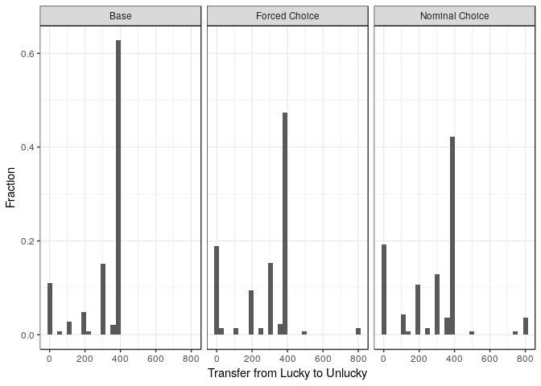
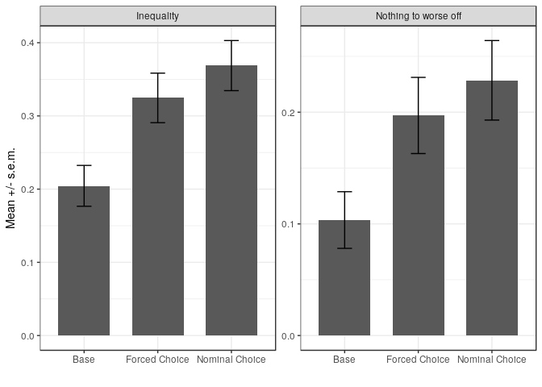

Revision part I
================
Erik
30 september, 2018

Reading in data
===============

``` r
df_l <- read_dta("data/bldata.dta") %>%
  mutate(choice = (T %in% c(2,3)),
         inequality = abs(800 - 2*transfer)/800,
         zero_to_worst_off = (transfer %in% c(0,800)),
         female = (sex==2),
         crt_h = (cr %in% c(2,3)),
         age_h = (age >= median(age)),
         treatmentorg = fct_recode(as_factor(T),
                                   "Base" = "1:No choice",
                                   "Forced Choice" = "3:Forced choice",
                                   "Nominal Choice" = "2:Nominal choice"),
         treatment = fct_relevel(treatmentorg, c("Base", "Forced Choice", "Nominal Choice")),
         leftp = !(polparty %in% c(6,7)))
```

Descriptive graphs
==================

Histograms by treatment
-----------------------

``` r
df_l %>% ggplot(aes(x=transfer, y=1* (..count..)/tapply(..count..,..PANEL..,sum)[..PANEL..])) + 
  geom_histogram() + facet_wrap(~treatment) + theme_bw() + ylab("Fraction") + 
  xlab("Transfer from Lucky to Unlucky")
```

    ## `stat_bin()` using `bins = 30`. Pick better value with `binwidth`.



``` r
ggsave("graphs/histograms_lab.pdf")
```

    ## Saving 7 x 5 in image
    ## `stat_bin()` using `bins = 30`. Pick better value with `binwidth`.

### Counting different aspects

Counting the proportions that equalize:

``` r
dfl_equal <- df_l %>% group_by(treatment) %>% mutate(equal= (transfer==400)) 
dfl_equal %>% summarize(mean_equal=mean(equal))
```

    ## # A tibble: 3 x 2
    ##   treatment      mean_equal
    ##   <fct>               <dbl>
    ## 1 Base                0.628
    ## 2 Forced Choice       0.474
    ## 3 Nominal Choice      0.421

``` r
ce_l <- dfl_equal %>%
  group_by(treatment) %>% summarize( yc= sum(transfer==400), n=n())
prop.test(ce_l$yc[ce_l$treatment %in% c("Base", "Nominal Choice") ], 
          ce_l$n[ce_l$treatment %in% c("Base", "Nominal Choice") ])
```

    ## 
    ##  2-sample test for equality of proportions with continuity
    ##  correction
    ## 
    ## data:  ce_l$yc[ce_l$treatment %in% c("Base", "Nominal Choice")] out of ce_l$n[ce_l$treatment %in% c("Base", "Nominal Choice")]
    ## X-squared = 11.33, df = 1, p-value = 0.0007627
    ## alternative hypothesis: two.sided
    ## 95 percent confidence interval:
    ##  0.0856377 0.3266776
    ## sample estimates:
    ##    prop 1    prop 2 
    ## 0.6275862 0.4214286

``` r
prop.test(ce_l$yc[ce_l$treatment %in% c("Base", "Forced Choice") ], 
          ce_l$n[ce_l$treatment %in% c("Base", "Forced Choice") ])
```

    ## 
    ##  2-sample test for equality of proportions with continuity
    ##  correction
    ## 
    ## data:  ce_l$yc[ce_l$treatment %in% c("Base", "Forced Choice")] out of ce_l$n[ce_l$treatment %in% c("Base", "Forced Choice")]
    ## X-squared = 6.078, df = 1, p-value = 0.01369
    ## alternative hypothesis: two.sided
    ## 95 percent confidence interval:
    ##  0.03121584 0.27505146
    ## sample estimates:
    ##    prop 1    prop 2 
    ## 0.6275862 0.4744526

Counting the proportions that give nothing to the unlucky participant

``` r
dfl_nothing <- df_l %>% group_by(treatment) %>% mutate(nothing= (transfer==0)) 
dfl_nothing %>% summarize(mean_nothing=mean(nothing))
```

    ## # A tibble: 3 x 2
    ##   treatment      mean_nothing
    ##   <fct>                 <dbl>
    ## 1 Base                  0.103
    ## 2 Forced Choice         0.182
    ## 3 Nominal Choice        0.193

``` r
ce_n <- dfl_nothing %>%
  group_by(treatment) %>% summarize( yc= sum(transfer==0), n=n())
prop.test(ce_n$yc[ce_n$treatment %in% c("Base", "Nominal Choice") ], 
          ce_n$n[ce_n$treatment %in% c("Base", "Nominal Choice") ])
```

    ## 
    ##  2-sample test for equality of proportions with continuity
    ##  correction
    ## 
    ## data:  ce_n$yc[ce_n$treatment %in% c("Base", "Nominal Choice")] out of ce_n$n[ce_n$treatment %in% c("Base", "Nominal Choice")]
    ## X-squared = 3.8479, df = 1, p-value = 0.04981
    ## alternative hypothesis: two.sided
    ## 95 percent confidence interval:
    ##  -0.1784551854 -0.0003625486
    ## sample estimates:
    ##    prop 1    prop 2 
    ## 0.1034483 0.1928571

``` r
prop.test(ce_n$yc[ce_n$treatment %in% c("Base", "Forced Choice") ], 
          ce_n$n[ce_n$treatment %in% c("Base", "Forced Choice") ])
```

    ## 
    ##  2-sample test for equality of proportions with continuity
    ##  correction
    ## 
    ## data:  ce_n$yc[ce_n$treatment %in% c("Base", "Forced Choice")] out of ce_n$n[ce_n$treatment %in% c("Base", "Forced Choice")]
    ## X-squared = 2.9947, df = 1, p-value = 0.08354
    ## alternative hypothesis: two.sided
    ## 95 percent confidence interval:
    ##  -0.167618608  0.009551656
    ## sample estimates:
    ##    prop 1    prop 2 
    ## 0.1034483 0.1824818

mean inequality and nothing to worst off by treatment (with SEM).
-----------------------------------------------------------------

``` r
df_mean_ineq_nothing_lab <- df_l %>% dplyr::select(treatment, inequality, zero_to_worst_off) %>%
  gather(inequality, zero_to_worst_off, key="outcome", value="y") %>%
  group_by(treatment, outcome) %>%
  summarize(mean_y = mean(y, na.rm=TRUE), se_y = sd(y, na.rm=TRUE)/sqrt(n())) %>%
  mutate(outcome = fct_recode(outcome, 
                              "Inequality" = "inequality",
                              "Nothing to worse off" = "zero_to_worst_off"))
```

    ## Warning: attributes are not identical across measure variables;
    ## they will be dropped

``` r
df_mean_ineq_nothing_lab %>%
ggplot(aes(x=treatment, y=mean_y)) + geom_bar(stat="identity", width=0.7) +
  geom_errorbar(aes(ymax=mean_y+se_y, ymin=mean_y - se_y), width=0.2) + 
  facet_wrap(~ outcome, scales="free") + ylab("Mean +/- s.e.m.") +
  theme_bw() + xlab("")
```



``` r
ggsave("graphs/mean_ineq_nothing_lab.pdf")
```

    ## Saving 7 x 5 in image

### Counting different aspects

``` r
df_mean_ineq_nothing_lab %>% knitr::kable()
```

| treatment      | outcome              |    mean\_y|      se\_y|
|:---------------|:---------------------|----------:|----------:|
| Base           | Inequality           |  0.2044828|  0.0279023|
| Base           | Nothing to worse off |  0.1034483|  0.0253786|
| Forced Choice  | Inequality           |  0.3246350|  0.0338496|
| Forced Choice  | Nothing to worse off |  0.1970803|  0.0341105|
| Nominal Choice | Inequality           |  0.3687500|  0.0342227|
| Nominal Choice | Nothing to worse off |  0.2285714|  0.0356165|

``` r
df_l_outcomes <- df_l %>% dplyr::select(treatment, inequality, zero_to_worst_off) %>%
  gather(inequality, zero_to_worst_off, key="outcome", value="y") %>%
  group_by(treatment, outcome)
```

    ## Warning: attributes are not identical across measure variables;
    ## they will be dropped

``` r
df_l_outcomes %>% filter(outcome=="inequality") %>% 
  filter(treatment %in% c("Base", "Nominal Choice")) %>% t.test(y~treatment, data=.)
```

    ## 
    ##  Welch Two Sample t-test
    ## 
    ## data:  y by treatment
    ## t = -3.7202, df = 270.04, p-value = 0.0002422
    ## alternative hypothesis: true difference in means is not equal to 0
    ## 95 percent confidence interval:
    ##  -0.25120051 -0.07733397
    ## sample estimates:
    ##           mean in group Base mean in group Nominal Choice 
    ##                    0.2044828                    0.3687500

``` r
df_l_outcomes %>% filter(outcome=="inequality") %>% 
  filter(treatment %in% c("Base", "Forced Choice")) %>% t.test(y~treatment, data=.)
```

    ## 
    ##  Welch Two Sample t-test
    ## 
    ## data:  y by treatment
    ## t = -2.739, df = 267.13, p-value = 0.006577
    ## alternative hypothesis: true difference in means is not equal to 0
    ## 95 percent confidence interval:
    ##  -0.20652168 -0.03378288
    ## sample estimates:
    ##          mean in group Base mean in group Forced Choice 
    ##                   0.2044828                   0.3246350

Counting the proportions that give nothing to the worst off participant

``` r
dfl_nwo <- df_l %>% group_by(treatment) %>% mutate(nwo= (transfer %in% c(0,800))) 
dfl_nwo %>% summarize(mean_nwo=mean(nwo))
```

    ## # A tibble: 3 x 2
    ##   treatment      mean_nwo
    ##   <fct>             <dbl>
    ## 1 Base              0.103
    ## 2 Forced Choice     0.197
    ## 3 Nominal Choice    0.229

``` r
ce_nwo <- dfl_nwo %>%
  group_by(treatment) %>% summarize( yc= sum(nwo), n=n())
prop.test(ce_nwo$yc[ce_nwo$treatment %in% c("Base", "Nominal Choice") ], 
          ce_nwo$n[ce_nwo$treatment %in% c("Base", "Nominal Choice") ])
```

    ## 
    ##  2-sample test for equality of proportions with continuity
    ##  correction
    ## 
    ## data:  ce_nwo$yc[ce_nwo$treatment %in% c("Base", "Nominal Choice")] out of ce_nwo$n[ce_nwo$treatment %in% c("Base", "Nominal Choice")]
    ## X-squared = 7.2143, df = 1, p-value = 0.007233
    ## alternative hypothesis: two.sided
    ## 95 percent confidence interval:
    ##  -0.21755565 -0.03269066
    ## sample estimates:
    ##    prop 1    prop 2 
    ## 0.1034483 0.2285714

``` r
prop.test(ce_nwo$yc[ce_nwo$treatment %in% c("Base", "Forced Choice") ], 
          ce_nwo$n[ce_nwo$treatment %in% c("Base", "Forced Choice") ])
```

    ## 
    ##  2-sample test for equality of proportions with continuity
    ##  correction
    ## 
    ## data:  ce_nwo$yc[ce_nwo$treatment %in% c("Base", "Forced Choice")] out of ce_nwo$n[ce_nwo$treatment %in% c("Base", "Forced Choice")]
    ## X-squared = 4.1615, df = 1, p-value = 0.04135
    ## alternative hypothesis: two.sided
    ## 95 percent confidence interval:
    ##  -0.183760871 -0.003503161
    ## sample estimates:
    ##    prop 1    prop 2 
    ## 0.1034483 0.1970803

Regressions for paper
=====================

Main treatment effects
----------------------

``` r
t1ineq1_l <- df_l %>% lm(inequality ~ treatment , data=.)
t1ineq2_l <- df_l %>% lm(inequality ~ treatment + leftp + female + age_h + crt_h, data=.)
t1noth1_l <- df_l %>% lm(zero_to_worst_off ~treatment , data=.)
t1noth2_l <- df_l %>% lm(zero_to_worst_off ~treatment + leftp + female + age_h + crt_h , data=.)
stargazer(t1ineq1_l, t1ineq2_l, t1noth1_l, t1noth2_l,
          se = list(sqrt(diag(cluster.vcov(t1ineq1_l, cluster=1:nrow(df_l)))),
                    sqrt(diag(cluster.vcov(t1ineq2_l, cluster=1:nrow(df_l)))),
                    sqrt(diag(cluster.vcov(t1noth1_l, cluster=1:nrow(df_l)))),
                    sqrt(diag(cluster.vcov(t1noth2_l, cluster=1:nrow(df_l))))),
         type="text", style="aer", df=FALSE, keep.stat=c("rsq","n"),
         star.char=c("", "",""), notes="", notes.append=FALSE, report="vcsp")
```

    ## 
    ## ===============================================================
    ##                             inequality       zero_to_worst_off 
    ##                            (1)       (2)       (3)       (4)   
    ## ---------------------------------------------------------------
    ## treatmentForced Choice    0.120     0.125     0.094     0.101  
    ##                          (0.044)   (0.044)   (0.043)   (0.042) 
    ##                         p = 0.007 p = 0.005 p = 0.028 p = 0.017
    ##                                                                
    ## treatmentNominal Choice   0.164     0.163     0.125     0.128  
    ##                          (0.044)   (0.044)   (0.044)   (0.043) 
    ##                         p = 0.001 p = 0.001 p = 0.005 p = 0.003
    ##                                                                
    ## leftp                              -0.115              -0.075  
    ##                                    (0.037)             (0.037) 
    ##                                   p = 0.003           p = 0.044
    ##                                                                
    ## female                             -0.108              -0.159  
    ##                                    (0.040)             (0.039) 
    ##                                   p = 0.007           p = 0.000
    ##                                                                
    ## age_h                               0.017               0.051  
    ##                                    (0.037)             (0.036) 
    ##                                   p = 0.646           p = 0.157
    ##                                                                
    ## crt_h                               0.001               0.009  
    ##                                    (0.040)             (0.039) 
    ##                                   p = 0.984           p = 0.827
    ##                                                                
    ## Constant                  0.204     0.310     0.103     0.182  
    ##                          (0.028)   (0.051)   (0.025)   (0.047) 
    ##                         p = 0.000 p = 0.000 p = 0.000 p = 0.000
    ##                                                                
    ## Observations               422       422       422       422   
    ## R2                        0.033     0.081     0.020     0.086  
    ## ---------------------------------------------------------------
    ## Notes:

(And to disk, no output)

Interactions with choice, inequality
------------------------------------

Now for the role of interaction. Previously we focused on the political interaction only, currently we aim to look broader at the heterogeneity. I make one table for the paper (inequality).

``` r
t2ineq1 <- df_l %>% lm(inequality ~ choice + leftp + female + age_h + crt_h, 
                         data=.)
t2ineq2 <- df_l %>% lm(inequality ~ choice + leftp + female + age_h + crt_h +
                         choice*leftp , data=.)
t2ineq3 <- df_l %>% lm(inequality ~ choice + leftp + + female + age_h + crt_h + 
                         choice*female, data=.)
t2ineq4 <- df_l %>% lm(inequality ~ choice + leftp + female + age_h + crt_h +
                         choice*age_h, data=.)
t2ineq5 <- df_l %>% lm(inequality ~ choice + leftp + female + age_h + crt_h +
                          choice*crt_h, data=.)
t2ineq6 <- df_l %>% lm(inequality ~ choice + leftp + female + age_h + crt_h +
                           choice*leftp + choice*female + choice*age_h + choice*crt_h, data=.)
```

We want linear combinations with standard errors as rows in the table:

``` r
c2 <- glht(t2ineq2, linfct="choiceTRUE + choiceTRUE:leftpTRUE = 0", 
             vcov = cluster.vcov(t2ineq2, cluster=1:nrow(df_l)))
c3 <- glht(t2ineq3, linfct="choiceTRUE + choiceTRUE:femaleTRUE = 0", 
             vcov = cluster.vcov(t2ineq3, cluster=1:nrow(df_l)))
c4 <- glht(t2ineq4, linfct="choiceTRUE + choiceTRUE:age_hTRUE = 0", 
             vcov = cluster.vcov(t2ineq4, cluster=1:nrow(df_l)))
c5 <- glht(t2ineq5, linfct="choiceTRUE + choiceTRUE:crt_hTRUE = 0", 
             vcov = cluster.vcov(t2ineq5, cluster=1:nrow(df_l)))
r1 <- c("Linear combination"," ", 
        sprintf("%4.3f", summary(c2)$test$coefficients[1]),
        sprintf("%4.3f", summary(c3)$test$coefficients[1]),
        sprintf("%4.3f", summary(c4)$test$coefficients[1]),
        sprintf("%4.3f", summary(c5)$test$coefficients[1]),
        "")
r2 <- c("","",
        sprintf("(%4.3f)", summary(c2)$test$sigma[1]),
        sprintf("(%4.3f)", summary(c3)$test$sigma[1]),
        sprintf("(%4.3f)", summary(c4)$test$sigma[1]),
        sprintf("(%4.3f)", summary(c5)$test$sigma[1]),
        "")
r3 <- c("", "",
        sprintf("p=%4.3f", summary(c2)$test$pvalues[1]),
        sprintf("p=%4.3f", summary(c3)$test$pvalues[1]),
        sprintf("p=%4.3f", summary(c4)$test$pvalues[1]),
        sprintf("p=%4.3f", summary(c5)$test$pvalues[1]),
        "")
```

``` r
stargazer(t2ineq1, t2ineq2, t2ineq3, t2ineq4, t2ineq5, t2ineq6,
          se = list(sqrt(diag(cluster.vcov(t2ineq1, cluster=1:nrow(df_l)))),
                    sqrt(diag(cluster.vcov(t2ineq2, cluster=1:nrow(df_l)))),
                    sqrt(diag(cluster.vcov(t2ineq3, cluster=1:nrow(df_l)))),
                    sqrt(diag(cluster.vcov(t2ineq4, cluster=1:nrow(df_l)))),
                    sqrt(diag(cluster.vcov(t2ineq5, cluster=1:nrow(df_l)))),
                    sqrt(diag(cluster.vcov(t2ineq6, cluster=1:nrow(df_l))))),
        order=c("choice","choiceTRUE:leftp","choiceTRUE:female", "choiceTRUE:age_h",
                "choiceTRUE:crt_h"),
         type="text", style="aer", df=FALSE, keep.stat=c("rsq","n"), p.auto=TRUE,
        add.lines= list(r1,r2,r3),
         star.char=c("", "",""), notes="", notes.append=FALSE, report="vcsp")
```

    ## 
    ## ==============================================================================
    ##                                            inequality                         
    ##                       (1)       (2)       (3)       (4)       (5)       (6)   
    ## ------------------------------------------------------------------------------
    ## choice               0.144     0.258     0.250     0.157     0.105     0.361  
    ##                     (0.037)   (0.058)   (0.053)   (0.055)   (0.054)   (0.098) 
    ##                    p = 0.001 p = 0.000 p = 0.000 p = 0.005 p = 0.054 p = 0.001
    ##                                                                               
    ## choiceTRUE:leftp              -0.192                                  -0.146  
    ##                               (0.074)                                 (0.075) 
    ##                              p = 0.010                               p = 0.052
    ##                                                                               
    ## choiceTRUE:female                       -0.235                        -0.216  
    ##                                         (0.073)                       (0.085) 
    ##                                        p = 0.002                     p = 0.012
    ##                                                                               
    ## choiceTRUE:age_h                                  -0.021              -0.044  
    ##                                                   (0.075)             (0.075) 
    ##                                                  p = 0.779           p = 0.563
    ##                                                                               
    ## choiceTRUE:crt_h                                             0.072    -0.011  
    ##                                                             (0.075)   (0.084) 
    ##                                                            p = 0.335 p = 0.892
    ##                                                                               
    ## leftp               -0.116     0.012    -0.124    -0.116    -0.115    -0.027  
    ##                     (0.037)   (0.058)   (0.037)   (0.038)   (0.038)   (0.058) 
    ##                    p = 0.002 p = 0.843 p = 0.001 p = 0.002 p = 0.003 p = 0.643
    ##                                                                               
    ## female              -0.109    -0.116     0.052    -0.108    -0.113     0.036  
    ##                     (0.040)   (0.040)   (0.061)   (0.040)   (0.040)   (0.070) 
    ##                    p = 0.007 p = 0.004 p = 0.400 p = 0.008 p = 0.006 p = 0.610
    ##                                                                               
    ## age_h                0.018     0.018     0.029     0.032     0.020     0.057  
    ##                     (0.037)   (0.036)   (0.037)   (0.059)   (0.037)   (0.060) 
    ##                    p = 0.622 p = 0.621 p = 0.427 p = 0.587 p = 0.586 p = 0.338
    ##                                                                               
    ## crt_h               -0.003    -0.005     0.010    -0.003    -0.051     0.014  
    ##                     (0.040)   (0.040)   (0.039)   (0.040)   (0.062)   (0.068) 
    ##                    p = 0.948 p = 0.901 p = 0.799 p = 0.940 p = 0.416 p = 0.836
    ##                                                                               
    ## Constant             0.312     0.240     0.232     0.303     0.338     0.162  
    ##                     (0.051)   (0.056)   (0.059)   (0.059)   (0.058)   (0.078) 
    ##                    p = 0.000 p = 0.000 p = 0.000 p = 0.000 p = 0.000 p = 0.038
    ##                                                                               
    ## Linear combination             0.066     0.015     0.136     0.177            
    ##                               (0.047)   (0.050)   (0.050)   (0.051)           
    ##                               p=0.160   p=0.765   p=0.007   p=0.001           
    ## Observations          422       422       422       422       422       422   
    ## R2                   0.080     0.093     0.100     0.080     0.082     0.109  
    ## ------------------------------------------------------------------------------
    ## Notes:

(And to disk, no output)

### Restricting to nominal choice (inequality)

First defining the subset of data

``` r
df_nc <- df_l %>% filter(treatment != "Forced Choice")
```

Now, rerunning on the restricted data.

``` r
nct2ineq1 <- df_nc %>% lm(inequality ~ choice + leftp + female + age_h + crt_h, 
                         data=.)
nct2ineq2 <- df_nc %>% lm(inequality ~ choice + leftp + female + age_h + crt_h +
                         choice*leftp , data=.)
nct2ineq3 <- df_nc %>% lm(inequality ~ choice + leftp + + female + age_h + crt_h + 
                         choice*female, data=.)
nct2ineq4 <- df_nc %>% lm(inequality ~ choice + leftp + female + age_h + crt_h +
                         choice*age_h, data=.)
nct2ineq5 <- df_nc %>% lm(inequality ~ choice + leftp + female + age_h + crt_h +
                          choice*crt_h, data=.)
nct2ineq6 <- df_nc %>% lm(inequality ~ choice + leftp + female + age_h + crt_h +
                           choice*leftp + choice*female + choice*age_h + choice*crt_h, data=.)
```

We want linear combinations with standard errors as rows in the table:

``` r
nc2 <- glht(nct2ineq2, linfct="choiceTRUE + choiceTRUE:leftpTRUE = 0", 
             vcov = cluster.vcov(nct2ineq2, cluster=1:nrow(df_nc)))
nc3 <- glht(nct2ineq3, linfct="choiceTRUE + choiceTRUE:femaleTRUE = 0", 
             vcov = cluster.vcov(nct2ineq3, cluster=1:nrow(df_nc)))
nc4 <- glht(nct2ineq4, linfct="choiceTRUE + choiceTRUE:age_hTRUE = 0", 
             vcov = cluster.vcov(nct2ineq4, cluster=1:nrow(df_nc)))
nc5 <- glht(nct2ineq5, linfct="choiceTRUE + choiceTRUE:crt_hTRUE = 0", 
             vcov = cluster.vcov(nct2ineq5, cluster=1:nrow(df_nc)))
nr1 <- c("Linear combination"," ", 
        sprintf("%4.3f", summary(nc2)$test$coefficients[1]),
        sprintf("%4.3f", summary(nc3)$test$coefficients[1]),
        sprintf("%4.3f", summary(nc4)$test$coefficients[1]),
        sprintf("%4.3f", summary(nc5)$test$coefficients[1]),
        "")
nr2 <- c("","",
        sprintf("(%4.3f)", summary(nc2)$test$sigma[1]),
        sprintf("(%4.3f)", summary(nc3)$test$sigma[1]),
        sprintf("(%4.3f)", summary(nc4)$test$sigma[1]),
        sprintf("(%4.3f)", summary(nc5)$test$sigma[1]),
        "")
nr3 <- c("", "",
        sprintf("p=%4.3f", summary(nc2)$test$pvalues[1]),
        sprintf("p=%4.3f", summary(nc3)$test$pvalues[1]),
        sprintf("p=%4.3f", summary(nc4)$test$pvalues[1]),
        sprintf("p=%4.3f", summary(nc5)$test$pvalues[1]),
        "")
```

``` r
stargazer(nct2ineq1, nct2ineq2, nct2ineq3, nct2ineq4, nct2ineq5, nct2ineq6,
          se = list(sqrt(diag(cluster.vcov(nct2ineq1, cluster=1:nrow(df_nc)))),
                    sqrt(diag(cluster.vcov(nct2ineq2, cluster=1:nrow(df_nc)))),
                    sqrt(diag(cluster.vcov(nct2ineq3, cluster=1:nrow(df_nc)))),
                    sqrt(diag(cluster.vcov(nct2ineq4, cluster=1:nrow(df_nc)))),
                    sqrt(diag(cluster.vcov(nct2ineq5, cluster=1:nrow(df_nc)))),
                    sqrt(diag(cluster.vcov(nct2ineq6, cluster=1:nrow(df_nc))))),
        order=c("choice","choiceTRUE:leftp","choiceTRUE:female", "choiceTRUE:age_h",
                "choiceTRUE:crt_h"),
         type="text", style="aer", df=FALSE, keep.stat=c("rsq","n"), p.auto=TRUE,
        add.lines= list(nr1,nr2,nr3),
         star.char=c("", "",""), notes="", notes.append=FALSE, report="vcsp")
```

    ## 
    ## ==============================================================================
    ##                                            inequality                         
    ##                       (1)       (2)       (3)       (4)       (5)       (6)   
    ## ------------------------------------------------------------------------------
    ## choice               0.164     0.263     0.285     0.148     0.139     0.373  
    ##                     (0.044)   (0.068)   (0.065)   (0.066)   (0.062)   (0.116) 
    ##                    p = 0.001 p = 0.001 p = 0.000 p = 0.024 p = 0.026 p = 0.002
    ##                                                                               
    ## choiceTRUE:leftp              -0.171                                  -0.118  
    ##                               (0.089)                                 (0.092) 
    ##                              p = 0.055                               p = 0.200
    ##                                                                               
    ## choiceTRUE:female                       -0.264                        -0.257  
    ##                                         (0.086)                       (0.101) 
    ##                                        p = 0.003                     p = 0.011
    ##                                                                               
    ## choiceTRUE:age_h                                   0.026               0.013  
    ##                                                   (0.089)             (0.090) 
    ##                                                  p = 0.770           p = 0.889
    ##                                                                               
    ## choiceTRUE:crt_h                                             0.050    -0.058  
    ##                                                             (0.089)   (0.099) 
    ##                                                            p = 0.577 p = 0.558
    ##                                                                               
    ## leftp               -0.079     0.006    -0.083    -0.079    -0.077    -0.027  
    ##                     (0.046)   (0.058)   (0.045)   (0.046)   (0.046)   (0.058) 
    ##                    p = 0.084 p = 0.922 p = 0.068 p = 0.083 p = 0.098 p = 0.644
    ##                                                                               
    ## female              -0.098    -0.101     0.039    -0.099    -0.100     0.036  
    ##                     (0.051)   (0.051)   (0.064)   (0.051)   (0.052)   (0.070) 
    ##                    p = 0.056 p = 0.047 p = 0.535 p = 0.055 p = 0.052 p = 0.612
    ##                                                                               
    ## age_h                0.048     0.052     0.062     0.035     0.048     0.057  
    ##                     (0.045)   (0.045)   (0.045)   (0.059)   (0.045)   (0.060) 
    ##                    p = 0.290 p = 0.251 p = 0.167 p = 0.559 p = 0.283 p = 0.341
    ##                                                                               
    ## crt_h               -0.022    -0.029    -0.010    -0.022    -0.047     0.014  
    ##                     (0.049)   (0.050)   (0.049)   (0.049)   (0.064)   (0.068) 
    ##                    p = 0.661 p = 0.555 p = 0.841 p = 0.664 p = 0.466 p = 0.837
    ##                                                                               
    ## Constant             0.277     0.229     0.203     0.285     0.289     0.162  
    ##                     (0.060)   (0.063)   (0.066)   (0.066)   (0.063)   (0.078) 
    ##                    p = 0.000 p = 0.001 p = 0.002 p = 0.000 p = 0.000 p = 0.039
    ##                                                                               
    ## Linear combination             0.093     0.021     0.174     0.188            
    ##                               (0.057)   (0.055)   (0.059)   (0.063)           
    ##                               p=0.105   p=0.704   p=0.003   p=0.003           
    ## Observations          285       285       285       285       285       285   
    ## R2                   0.081     0.094     0.111     0.082     0.082     0.117  
    ## ------------------------------------------------------------------------------
    ## Notes:

(And to disk, no output)

### Restricting to forced choice (inequality)

First defining the subset of data

``` r
df_fc <- df_l %>% filter(treatment != "Nominal Choice")
```

Now, rerunning on the restricted data.

``` r
fct2ineq1 <- df_fc %>% lm(inequality ~ choice + leftp + female + age_h + crt_h, 
                         data=.)
fct2ineq2 <- df_fc %>% lm(inequality ~ choice + leftp + female + age_h + crt_h +
                         choice*leftp , data=.)
fct2ineq3 <- df_fc %>% lm(inequality ~ choice + leftp + + female + age_h + crt_h + 
                         choice*female, data=.)
fct2ineq4 <- df_fc %>% lm(inequality ~ choice + leftp + female + age_h + crt_h +
                         choice*age_h, data=.)
fct2ineq5 <- df_fc %>% lm(inequality ~ choice + leftp + female + age_h + crt_h +
                          choice*crt_h, data=.)
fct2ineq6 <- df_fc %>% lm(inequality ~ choice + leftp + female + age_h + crt_h +
                           choice*leftp + choice*female + choice*age_h + choice*crt_h, data=.)
```

We want linear combinations with standard errors as rows in the table:

``` r
fc2 <- glht(fct2ineq2, linfct="choiceTRUE + choiceTRUE:leftpTRUE = 0", 
             vcov = cluster.vcov(fct2ineq2, cluster=1:nrow(df_fc)))
fc3 <- glht(fct2ineq3, linfct="choiceTRUE + choiceTRUE:femaleTRUE = 0", 
             vcov = cluster.vcov(fct2ineq3, cluster=1:nrow(df_fc)))
fc4 <- glht(fct2ineq4, linfct="choiceTRUE + choiceTRUE:age_hTRUE = 0", 
             vcov = cluster.vcov(fct2ineq4, cluster=1:nrow(df_fc)))
fc5 <- glht(fct2ineq5, linfct="choiceTRUE + choiceTRUE:crt_hTRUE = 0", 
             vcov = cluster.vcov(fct2ineq5, cluster=1:nrow(df_fc)))
fr1 <- c("Linear combination"," ", 
        sprintf("%4.3f", summary(fc2)$test$coefficients[1]),
        sprintf("%4.3f", summary(fc3)$test$coefficients[1]),
        sprintf("%4.3f", summary(fc4)$test$coefficients[1]),
        sprintf("%4.3f", summary(fc5)$test$coefficients[1]),
        "")
fr2 <- c("","",
        sprintf("(%4.3f)", summary(fc2)$test$sigma[1]),
        sprintf("(%4.3f)", summary(fc3)$test$sigma[1]),
        sprintf("(%4.3f)", summary(fc4)$test$sigma[1]),
        sprintf("(%4.3f)", summary(fc5)$test$sigma[1]),
        "")
fr3 <- c("", "",
        sprintf("p=%4.3f", summary(fc2)$test$pvalues[1]),
        sprintf("p=%4.3f", summary(fc3)$test$pvalues[1]),
        sprintf("p=%4.3f", summary(fc4)$test$pvalues[1]),
        sprintf("p=%4.3f", summary(fc5)$test$pvalues[1]),
        "")
```

``` r
stargazer(fct2ineq1, fct2ineq2, fct2ineq3, fct2ineq4, fct2ineq5, fct2ineq6,
          se = list(sqrt(diag(cluster.vcov(fct2ineq1, cluster=1:nrow(df_fc)))),
                    sqrt(diag(cluster.vcov(fct2ineq2, cluster=1:nrow(df_fc)))),
                    sqrt(diag(cluster.vcov(fct2ineq3, cluster=1:nrow(df_fc)))),
                    sqrt(diag(cluster.vcov(fct2ineq4, cluster=1:nrow(df_fc)))),
                    sqrt(diag(cluster.vcov(fct2ineq5, cluster=1:nrow(df_fc)))),
                    sqrt(diag(cluster.vcov(fct2ineq6, cluster=1:nrow(df_fc))))),
        order=c("choice","choiceTRUE:leftp","choiceTRUE:female", "choiceTRUE:age_h",
                "choiceTRUE:crt_h"),
         type="text", style="aer", df=FALSE, keep.stat=c("rsq","n"), p.auto=TRUE,
        add.lines= list(fr1,fr2,fr3),
         star.char=c("", "",""), notes="", notes.append=FALSE, report="vcsp")
```

    ## 
    ## ==============================================================================
    ##                                            inequality                         
    ##                       (1)       (2)       (3)       (4)       (5)       (6)   
    ## ------------------------------------------------------------------------------
    ## choice               0.119     0.245     0.214     0.170     0.063     0.347  
    ##                     (0.044)   (0.070)   (0.064)   (0.064)   (0.065)   (0.113) 
    ##                    p = 0.007 p = 0.001 p = 0.001 p = 0.008 p = 0.334 p = 0.003
    ##                                                                               
    ## choiceTRUE:leftp              -0.210                                  -0.187  
    ##                               (0.088)                                 (0.088) 
    ##                              p = 0.018                               p = 0.035
    ##                                                                               
    ## choiceTRUE:female                       -0.210                        -0.183  
    ##                                         (0.089)                       (0.097) 
    ##                                        p = 0.018                     p = 0.059
    ##                                                                               
    ## choiceTRUE:age_h                                  -0.086              -0.103  
    ##                                                   (0.088)             (0.088) 
    ##                                                  p = 0.332           p = 0.238
    ##                                                                               
    ## choiceTRUE:crt_h                                             0.097     0.048  
    ##                                                             (0.088)   (0.097) 
    ##                                                            p = 0.275 p = 0.622
    ##                                                                               
    ## leftp               -0.103     0.001    -0.117    -0.105    -0.105    -0.027  
    ##                     (0.045)   (0.058)   (0.045)   (0.045)   (0.045)   (0.058) 
    ##                    p = 0.022 p = 0.991 p = 0.009 p = 0.020 p = 0.019 p = 0.645
    ##                                                                               
    ## female              -0.052    -0.064     0.060    -0.048    -0.057     0.036  
    ##                     (0.047)   (0.047)   (0.064)   (0.048)   (0.048)   (0.070) 
    ##                    p = 0.278 p = 0.178 p = 0.355 p = 0.318 p = 0.237 p = 0.612
    ##                                                                               
    ## age_h               -0.001    -0.007     0.009     0.042     0.002     0.057  
    ##                     (0.044)   (0.043)   (0.044)   (0.059)   (0.044)   (0.060) 
    ##                    p = 0.978 p = 0.880 p = 0.833 p = 0.477 p = 0.963 p = 0.341
    ##                                                                               
    ## crt_h                0.023     0.026     0.040     0.021    -0.024     0.014  
    ##                     (0.048)   (0.048)   (0.048)   (0.048)   (0.064)   (0.069) 
    ##                    p = 0.629 p = 0.593 p = 0.407 p = 0.663 p = 0.706 p = 0.837
    ##                                                                               
    ## Constant             0.277     0.223     0.221     0.251     0.304     0.162  
    ##                     (0.059)   (0.060)   (0.065)   (0.064)   (0.065)   (0.078) 
    ##                    p = 0.000 p = 0.001 p = 0.001 p = 0.000 p = 0.000 p = 0.039
    ##                                                                               
    ## Linear combination             0.035     0.004     0.085     0.160            
    ##                               (0.055)   (0.059)   (0.060)   (0.059)           
    ##                               p=0.528   p=0.947   p=0.160   p=0.007           
    ## Observations          282       282       282       282       282       282   
    ## R2                   0.054     0.073     0.073     0.057     0.058     0.093  
    ## ------------------------------------------------------------------------------
    ## Notes:

(And to disk, no output)

### Interactions with choice, nothing to the worst off

We need similar interactions with our indicator for nothing to the worst off (for appendix).

``` r
t2noth1 <- df_l %>% lm(zero_to_worst_off ~ choice + leftp + female + age_h + crt_h, 
                         data=.)
t2noth2 <- df_l %>% lm(zero_to_worst_off ~ choice + leftp + female + age_h + crt_h +
                         choice*leftp , data=.)
t2noth3 <- df_l %>% lm(zero_to_worst_off ~ choice + leftp + + female + age_h + crt_h + 
                         choice*female, data=.)
t2noth4 <- df_l %>% lm(zero_to_worst_off ~ choice + leftp + female + age_h + crt_h +
                         choice*age_h, data=.)
t2noth5 <- df_l %>% lm(zero_to_worst_off ~ choice + leftp + female + age_h + crt_h +
                          choice*crt_h, data=.)
t2noth6 <- df_l %>% lm(zero_to_worst_off ~ choice + leftp + female + age_h + crt_h +
                           choice*leftp + choice*female + choice*age_h + choice*crt_h, data=.)
```

We want linear combinations with standard errors as rows in the table:

``` r
d2 <- glht(t2noth2, linfct="choiceTRUE + choiceTRUE:leftpTRUE = 0", 
             vcov = cluster.vcov(t2noth2, cluster=1:nrow(df_l)))
d3 <- glht(t2noth3, linfct="choiceTRUE + choiceTRUE:femaleTRUE = 0", 
             vcov = cluster.vcov(t2noth3, cluster=1:nrow(df_l)))
d4 <- glht(t2noth4, linfct="choiceTRUE + choiceTRUE:age_hTRUE = 0", 
             vcov = cluster.vcov(t2noth4, cluster=1:nrow(df_l)))
d5 <- glht(t2noth5, linfct="choiceTRUE + choiceTRUE:crt_hTRUE = 0", 
             vcov = cluster.vcov(t2noth5, cluster=1:nrow(df_l)))
s1 <- c("Linear combination"," ", 
        sprintf("%4.3f", summary(d2)$test$coefficients[1]),
        sprintf("%4.3f", summary(d3)$test$coefficients[1]),
        sprintf("%4.3f", summary(d4)$test$coefficients[1]),
        sprintf("%4.3f", summary(d5)$test$coefficients[1]),
        "")
s2 <- c("","",
        sprintf("(%4.3f)", summary(d2)$test$sigma[1]),
        sprintf("(%4.3f)", summary(d3)$test$sigma[1]),
        sprintf("(%4.3f)", summary(d4)$test$sigma[1]),
        sprintf("(%4.3f)", summary(d5)$test$sigma[1]),
        "")
s3 <- c("", "",
        sprintf("p=%4.3f", summary(d2)$test$pvalues[1]),
        sprintf("p=%4.3f", summary(d3)$test$pvalues[1]),
        sprintf("p=%4.3f", summary(d4)$test$pvalues[1]),
        sprintf("p=%4.3f", summary(d5)$test$pvalues[1]),
        "")
```

Table with p-values for reference:

``` r
stargazer(t2noth1, t2noth2, t2noth3, t2noth4, t2noth5, t2noth6,
          se = list(sqrt(diag(cluster.vcov(t2noth1, cluster=1:nrow(df_l)))),
                    sqrt(diag(cluster.vcov(t2noth2, cluster=1:nrow(df_l)))),
                    sqrt(diag(cluster.vcov(t2noth3, cluster=1:nrow(df_l)))),
                    sqrt(diag(cluster.vcov(t2noth4, cluster=1:nrow(df_l)))),
                    sqrt(diag(cluster.vcov(t2noth5, cluster=1:nrow(df_l)))),
                    sqrt(diag(cluster.vcov(t2noth6, cluster=1:nrow(df_l))))),
        order=c("choice","choiceTRUE:leftp","choiceTRUE:female", "choiceTRUE:age_h",
                "choiceTRUE:crt_h"),
        add.lines=list(s1,s2,s3), 
         type="text", style="aer", df=FALSE, keep.stat=c("rsq","n"), p.auto=TRUE,
         star.char=c("", "",""), notes="", notes.append=FALSE, report="vcsp")
```

    ## 
    ## ==============================================================================
    ##                                         zero_to_worst_off                     
    ##                       (1)       (2)       (3)       (4)       (5)       (6)   
    ## ------------------------------------------------------------------------------
    ## choice               0.115     0.191     0.217     0.109     0.068     0.266  
    ##                     (0.035)   (0.058)   (0.053)   (0.047)   (0.048)   (0.091) 
    ##                    p = 0.002 p = 0.002 p = 0.000 p = 0.022 p = 0.160 p = 0.004
    ##                                                                               
    ## choiceTRUE:leftp              -0.129                                  -0.085  
    ##                               (0.072)                                 (0.070) 
    ##                              p = 0.074                               p = 0.226
    ##                                                                               
    ## choiceTRUE:female                       -0.227                        -0.209  
    ##                                         (0.069)                       (0.077) 
    ##                                        p = 0.001                     p = 0.007
    ##                                                                               
    ## choiceTRUE:age_h                                   0.010              -0.016  
    ##                                                   (0.069)             (0.068) 
    ##                                                  p = 0.889           p = 0.816
    ##                                                                               
    ## choiceTRUE:crt_h                                             0.087     0.006  
    ##                                                             (0.070)   (0.078) 
    ##                                                            p = 0.214 p = 0.937
    ##                                                                               
    ## leftp               -0.076     0.010    -0.084    -0.076    -0.075    -0.026  
    ##                     (0.037)   (0.053)   (0.037)   (0.037)   (0.037)   (0.050) 
    ##                    p = 0.042 p = 0.851 p = 0.023 p = 0.042 p = 0.044 p = 0.599
    ##                                                                               
    ## female              -0.160    -0.164    -0.005    -0.160    -0.164    -0.019  
    ##                     (0.039)   (0.039)   (0.054)   (0.039)   (0.039)   (0.059) 
    ##                    p = 0.000 p = 0.000 p = 0.934 p = 0.000 p = 0.000 p = 0.745
    ##                                                                               
    ## age_h                0.051     0.051     0.062     0.045     0.054     0.072  
    ##                     (0.036)   (0.036)   (0.036)   (0.050)   (0.036)   (0.049) 
    ##                    p = 0.150 p = 0.150 p = 0.083 p = 0.368 p = 0.132 p = 0.144
    ##                                                                               
    ## crt_h                0.006     0.005     0.018     0.006    -0.052     0.012  
    ##                     (0.039)   (0.039)   (0.039)   (0.039)   (0.056)   (0.061) 
    ##                    p = 0.874 p = 0.906 p = 0.635 p = 0.870 p = 0.357 p = 0.845
    ##                                                                               
    ## Constant             0.184     0.135     0.107     0.188     0.215     0.076  
    ##                     (0.047)   (0.053)   (0.053)   (0.051)   (0.051)   (0.067) 
    ##                    p = 0.000 p = 0.011 p = 0.044 p = 0.001 p = 0.000 p = 0.259
    ##                                                                               
    ## Linear combination             0.063    -0.010     0.119     0.155            
    ##                               (0.043)   (0.043)   (0.049)   (0.051)           
    ##                               p=0.146   p=0.820   p=0.017   p=0.002           
    ## Observations          422       422       422       422       422       422   
    ## R2                   0.085     0.092     0.105     0.085     0.088     0.107  
    ## ------------------------------------------------------------------------------
    ## Notes:

(And to disk, no output)

Triple interactions
-------------------

The editor is interested in the possible triple interaction between political, left, and cognitive reflection.

``` r
triple1 <- df_l %>% lm(inequality ~ choice + leftp + crt_h + female + age_h  , data=.)
triple2 <- df_l %>% lm(inequality ~ choice + choice*leftp + leftp + crt_h + female + age_h, data=.)
triple3 <- df_l %>% lm(inequality ~ choice + choice*crt_h + leftp + crt_h + female + age_h, data=. )
triple4 <- df_l %>% lm(inequality ~ choice + choice*leftp + choice*crt_h + leftp + crt_h +  
                         female + age_h, data=. )
triple5 <- df_l %>% lm(inequality ~ choice + choice*leftp + choice*crt_h + leftp*crt_h + 
                         leftp + crt_h +  female + age_h, data=. )
triple6 <- df_l %>% lm(inequality ~ choice + choice*leftp + choice*crt_h + leftp*crt_h + 
                         choice*leftp*crt_h + leftp + crt_h +  female + age_h, data=. )
stargazer(triple1, triple2, triple3, triple4, triple5, triple6,
          se = list(sqrt(diag(cluster.vcov(triple1, cluster=1:nrow(df_l)))),
                    sqrt(diag(cluster.vcov(triple2, cluster=1:nrow(df_l)))),
                    sqrt(diag(cluster.vcov(triple3, cluster=1:nrow(df_l)))),
                    sqrt(diag(cluster.vcov(triple4, cluster=1:nrow(df_l)))),
                    sqrt(diag(cluster.vcov(triple5, cluster=1:nrow(df_l)))),
                    sqrt(diag(cluster.vcov(triple6, cluster=1:nrow(df_l))))),
        style="aer", df=FALSE, keep.stat=c("rsq","n"), p.auto=TRUE,
         star.char=c("", "",""), notes="", notes.append=FALSE, report="vcsp", type="text")
```

    ## 
    ## ======================================================================================
    ##                                                    inequality                         
    ##                               (1)       (2)       (3)       (4)       (5)       (6)   
    ## --------------------------------------------------------------------------------------
    ## choice                       0.144     0.258     0.105     0.221     0.216     0.192  
    ##                             (0.037)   (0.058)   (0.054)   (0.067)   (0.065)   (0.074) 
    ##                            p = 0.001 p = 0.000 p = 0.054 p = 0.001 p = 0.001 p = 0.010
    ##                                                                                       
    ## leftp                       -0.116     0.012    -0.115     0.011     0.164     0.140  
    ##                             (0.037)   (0.058)   (0.038)   (0.058)   (0.067)   (0.078) 
    ##                            p = 0.002 p = 0.843 p = 0.003 p = 0.854 p = 0.014 p = 0.075
    ##                                                                                       
    ## crt_h                       -0.003    -0.005    -0.051    -0.049     0.130     0.103  
    ##                             (0.040)   (0.040)   (0.062)   (0.061)   (0.074)   (0.088) 
    ##                            p = 0.948 p = 0.901 p = 0.416 p = 0.419 p = 0.079 p = 0.244
    ##                                                                                       
    ## female                      -0.109    -0.116    -0.113    -0.119    -0.110    -0.109  
    ##                             (0.040)   (0.040)   (0.040)   (0.040)   (0.040)   (0.040) 
    ##                            p = 0.007 p = 0.004 p = 0.006 p = 0.004 p = 0.006 p = 0.007
    ##                                                                                       
    ## age_h                        0.018     0.018     0.020     0.020     0.009     0.009  
    ##                             (0.037)   (0.036)   (0.037)   (0.036)   (0.036)   (0.036) 
    ##                            p = 0.622 p = 0.621 p = 0.586 p = 0.588 p = 0.809 p = 0.812
    ##                                                                                       
    ## choiceTRUE:leftp                      -0.192              -0.190    -0.176    -0.138  
    ##                                       (0.074)             (0.074)   (0.073)   (0.103) 
    ##                                      p = 0.010           p = 0.011 p = 0.016 p = 0.182
    ##                                                                                       
    ## choiceTRUE:crt_h                                 0.072     0.067     0.058     0.099  
    ##                                                 (0.075)   (0.074)   (0.072)   (0.111) 
    ##                                                p = 0.335 p = 0.366 p = 0.423 p = 0.375
    ##                                                                                       
    ## leftpTRUE:crt_h                                                     -0.289    -0.244  
    ##                                                                     (0.072)   (0.113) 
    ##                                                                    p = 0.000 p = 0.032
    ##                                                                                       
    ## choiceTRUE:leftpTRUE:crt_h                                                    -0.069  
    ##                                                                               (0.146) 
    ##                                                                              p = 0.637
    ##                                                                                       
    ## Constant                     0.312     0.240     0.338     0.264     0.170     0.184  
    ##                             (0.051)   (0.056)   (0.058)   (0.060)   (0.059)   (0.059) 
    ##                            p = 0.000 p = 0.000 p = 0.000 p = 0.000 p = 0.005 p = 0.002
    ##                                                                                       
    ## Observations                  422       422       422       422       422       422   
    ## R2                           0.080     0.093     0.082     0.095     0.128     0.128  
    ## --------------------------------------------------------------------------------------
    ## Notes:

(And to disk, no output)

Balance table (appendix)
========================

``` r
dfl_summary <- df_l %>% group_by(treatment) %>% summarize(mean_age = mean(age), se_age = sd(age)/sqrt(n()),
                                                          mean_female = mean(female), se_female=sd(female)/sqrt(n()),
                                                          mean_crt = mean(cr), se_crt = sd(cr)/sqrt(n()),
                                                          mean_left = mean(leftp), se_leftp=sd(leftp)/sqrt(n()),
                                                          n= n())
dfl_totals <- df_l %>% summarize(mean_age = mean(age), se_age = sd(age)/sqrt(n()),
                                 mean_female = mean(female), se_female=sd(female)/sqrt(n()),
                                 mean_crt = mean(cr), se_crt = sd(cr)/sqrt(n()),
                                 mean_left = mean(leftp), se_leftp=sd(leftp)/sqrt(n()),
                                 n= n())
```

Output of balance table

``` r
dfl_summary %>% knitr::kable(digits=c(3,1,2,2,2,2,2,2,2,0))
```

| treatment      |  mean\_age|  se\_age|  mean\_female|  se\_female|  mean\_crt|  se\_crt|  mean\_left|  se\_leftp|    n|
|:---------------|----------:|--------:|-------------:|-----------:|----------:|--------:|-----------:|----------:|----:|
| Base           |       22.9|     0.29|          0.44|        0.04|       1.58|     0.09|        0.60|       0.04|  145|
| Forced Choice  |       22.4|     0.22|          0.47|        0.04|       1.84|     0.09|        0.60|       0.04|  137|
| Nominal Choice |       22.7|     0.24|          0.47|        0.04|       1.55|     0.10|        0.56|       0.04|  140|

``` r
dfl_totals %>% knitr::kable(digits=c(1,2,2,2,2,2,2,2,0))
```

|  mean\_age|  se\_age|  mean\_female|  se\_female|  mean\_crt|  se\_crt|  mean\_left|  se\_leftp|    n|
|----------:|--------:|-------------:|-----------:|----------:|--------:|-----------:|----------:|----:|
|       22.7|     0.15|          0.46|        0.02|       1.65|     0.05|        0.59|       0.02|  422|

sessionInfo()
=============

``` r
sessionInfo()
```

    ## R version 3.5.1 (2018-07-02)
    ## Platform: x86_64-pc-linux-gnu (64-bit)
    ## Running under: Ubuntu 18.04.1 LTS
    ## 
    ## Matrix products: default
    ## BLAS: /usr/lib/x86_64-linux-gnu/blas/libblas.so.3.7.1
    ## LAPACK: /usr/lib/x86_64-linux-gnu/lapack/liblapack.so.3.7.1
    ## 
    ## locale:
    ##  [1] LC_CTYPE=en_US.UTF-8       LC_NUMERIC=C              
    ##  [3] LC_TIME=nb_NO.UTF-8        LC_COLLATE=en_US.UTF-8    
    ##  [5] LC_MONETARY=nb_NO.UTF-8    LC_MESSAGES=en_US.UTF-8   
    ##  [7] LC_PAPER=nb_NO.UTF-8       LC_NAME=C                 
    ##  [9] LC_ADDRESS=C               LC_TELEPHONE=C            
    ## [11] LC_MEASUREMENT=nb_NO.UTF-8 LC_IDENTIFICATION=C       
    ## 
    ## attached base packages:
    ## [1] stats     graphics  grDevices utils     datasets  methods   base     
    ## 
    ## other attached packages:
    ##  [1] bindrcpp_0.2.2     multiwayvcov_1.2.3 multcomp_1.4-8    
    ##  [4] TH.data_1.0-9      MASS_7.3-50        survival_2.42-6   
    ##  [7] mvtnorm_1.0-8      stargazer_5.2.2    haven_1.1.2       
    ## [10] forcats_0.3.0      stringr_1.3.1      dplyr_0.7.6       
    ## [13] purrr_0.2.5        readr_1.1.1        tidyr_0.8.1       
    ## [16] tibble_1.4.2       ggplot2_3.0.0      tidyverse_1.2.1   
    ## 
    ## loaded via a namespace (and not attached):
    ##  [1] Rcpp_0.12.18     lubridate_1.7.4  lattice_0.20-35  zoo_1.8-4       
    ##  [5] assertthat_0.2.0 rprojroot_1.3-2  digest_0.6.17    utf8_1.1.4      
    ##  [9] R6_2.2.2         cellranger_1.1.0 plyr_1.8.4       backports_1.1.2 
    ## [13] evaluate_0.11    httr_1.3.1       highr_0.7        pillar_1.3.0    
    ## [17] rlang_0.2.2      lazyeval_0.2.1   readxl_1.1.0     rstudioapi_0.7  
    ## [21] Matrix_1.2-14    rmarkdown_1.10   labeling_0.3     splines_3.5.1   
    ## [25] munsell_0.5.0    broom_0.5.0      compiler_3.5.1   modelr_0.1.2    
    ## [29] pkgconfig_2.0.2  htmltools_0.3.6  tidyselect_0.2.4 codetools_0.2-15
    ## [33] fansi_0.3.0      crayon_1.3.4     withr_2.1.2      grid_3.5.1      
    ## [37] nlme_3.1-137     jsonlite_1.5     gtable_0.2.0     magrittr_1.5    
    ## [41] scales_1.0.0     cli_1.0.0        stringi_1.2.4    xml2_1.2.0      
    ## [45] boot_1.3-20      sandwich_2.5-0   tools_3.5.1      glue_1.3.0      
    ## [49] hms_0.4.2        parallel_3.5.1   yaml_2.2.0       colorspace_1.3-2
    ## [53] rvest_0.3.2      knitr_1.20       bindr_0.1.1
